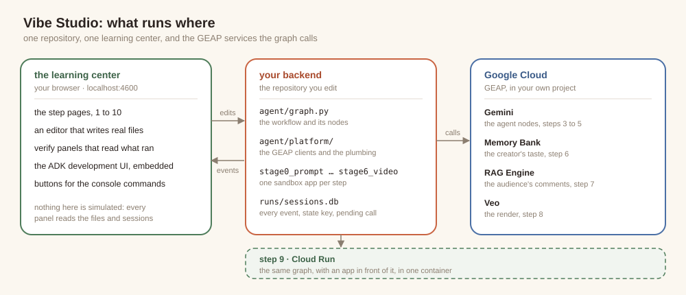
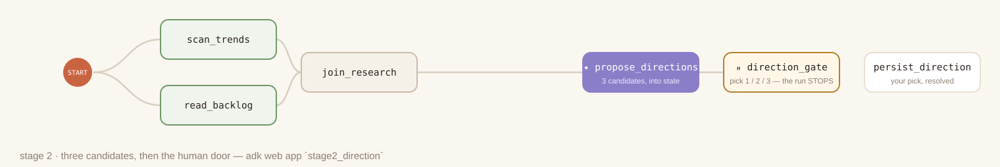
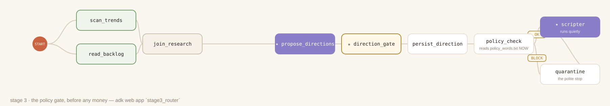

author: Annie Wang (cuppibla)
summary: Design agentic workflows as graphs with the Agent Development Kit (ADK): parallel nodes and joins, an agent as a node, RequestInput for human decisions, deterministic routers, and task-mode agents. Then add state, memory, and knowledge: session state and the user: prefix, GEAP Memory Bank through callbacks, and a GEAP RAG Engine corpus as one more reader in the fan-out.
id: vibestudio
categories: adk,agents,memory-bank,rag-engine,gemini,veo
environments: Web
status: Draft
feedback link: https://github.com/cuppibla/vibe-studio-lab/issues

# Agentic workflow with ADK

## Introduction
Duration: 0:03:00


This codelab is about agentic workflow design with the Agent Development Kit (ADK). You will learn how to express a multi-step agent system as an explicit graph rather than a single prompt, how to keep that graph's state outside the process so a run survives a restart, and how to connect the graph to managed services for memory, retrieval, and video generation.

### The scenario

You run a channel on VibeTube. You have a backlog of video ideas and no time for the production work each one requires: researching what is trending, reading through your backlog, choosing a direction, writing the script, generating the shots, reviewing the result, and publishing. A current generative model can perform each of those tasks on its own.

The remaining problem is process. You need a pipeline that runs the routine steps without supervision, asks you only for the decisions that require your judgment, refuses an unpublishable direction before it costs money, and carries what one video taught it into the next. A pipeline with those properties is repeatable and auditable, and you can hand it to another creator. That pipeline is what you build in this codelab. The application it powers is called Vibe Studio.


### What you learn

- `Workflow`, its edge list, `START`, and `JoinNode`, for a parallel fan-out and a join
- An `Agent` used as a workflow node, and the three agent modes: `chat`, `single_turn`, and `task`
- `RequestInput`, which suspends a graph for a human decision and declares the shape of the answer
- Session state: nodes write with `Event(state=...)` and read by parameter name
- A deterministic router node whose return value selects the outgoing edge
- GEAP Memory Bank through `before_model_callback` and `after_agent_callback`
- GEAP RAG Engine: a corpus of audience comments, read by one more node in the fan-out
- `LongRunningFunctionTool`, the pending receipt, and resuming a suspended call by id
- The `Runner`, an application on top of it, and a Cloud Run deployment

### How this codelab is organized

The work happens in a companion application called the **learning center**, a web application that runs beside the repository on port 4600. It carries the step pages, an editor that writes to the real files in the repository, verification panels that read the artifacts your runs produce, and the ADK development UI embedded in each run panel. The setup step starts it, and every step after that names the page to open.

This codelab is the reference that goes with it. Each section explains the ADK constructs the corresponding learning center step exercises, shows the code those constructs produce, and states the design rule behind them. Read the section, then open the page it names and do the work there.

The numbering matches. From the single-prompt step onward, step *n* of this codelab is step *n* of the learning center: step 4 here is step 4 there. Steps 1 and 2 of the learning center, the scenario and the shape of the finished graph, are reading rather than work, and you open them at the end of Setup.

The pipeline is built once, across the whole codelab. Three edits in `agent/graph.py` are used by every later step. If you skip ahead, the learning center page for the step you land on reports which earlier edits are still open and offers to apply them.

### Design rules

The graph you build follows five rules. Each section returns to the rule it demonstrates.

- A graph pauses for a person or for a receipt, never for a wait. Nothing stays alive on a suspended run's behalf.
- Every resume is one `function_response` carrying the id of the call that suspended the run.
- Nodes share state by key name rather than by passing values along the chain.
- Routing is plain code and policy is data, so a decision is reproducible and free.
- Context that belongs to one agent rides a callback on that agent. Work that produces data for the whole graph is a node.

## Setup
Duration: 0:09:00



Three parts make up the environment. The **learning center** (left) serves the step pages, the file editor, and the embedded ADK development UI. **Your backend** (middle) is one `Workflow` whose nodes live in `agent/`, plus a set of sandbox applications that each wire a subset of that graph. **Google Cloud** (right) provides Gemini for the agents, Memory Bank, RAG Engine, and Veo, all through GEAP.

### Before you begin

You need a Google Cloud project with billing enabled and the gcloud CLI authenticated. Cloud Shell has gcloud preinstalled and authenticated, and is the recommended environment for this codelab.

### Install

Open the Cloud Shell terminal. This codelab calls it **tab 1**. Clone the repository and run the two setup scripts in order.

```console
git clone https://github.com/cuppibla/vibe-studio-lab
cd ~/vibe-studio-lab
./setup_project.sh
./setup_codelab.sh
```

`setup_project.sh` creates a Google Cloud project with billing linked, or reuses the one it created on an earlier run, records the project ID in `~/project_id.txt`, and makes it the active gcloud project.

`setup_codelab.sh` prepares everything else. It installs uv and the locked dependencies into `.venv`, enables the APIs this codelab calls, asks for the event code of the room you publish to and the name you publish under, writes `.env`, makes one Gemini call to confirm the project answers, builds the learning center's page, starts the learning center in the background on port 4600, and finishes with the preflight check. Both scripts are safe to run again: the second one offers your previous answers as defaults and preserves any variable you added to `.env` by hand.

The output ends like this.

```
  ✓ learning center running in the background on http://localhost:4600  (log: runs/lab.log)
  ✓ python 3.12
  ✓ auth path A: Vertex via ADC (STUDIO_VERTEX=1)
  ✓ Google Cloud ADC (project <your-project>)
  ✓ stage0_prompt loads
  …
  ✓ stage6_video loads (15 edges)
  ✓ node and npm (build the learning center's page)
  ✓ learning center page built (web/dist)
  ✓ aiplatform.googleapis.com enabled (Gemini, Veo, Memory Bank, RAG Engine)
  …
  ✓ learning center running on port 4600

PREFLIGHT GREEN

Open step 1 here:  https://4600-<your cloud shell host>/step/story
```

Click the link on the last line to open the learning center at its first page. The same address is available under **Web Preview → Change port → 4600**.

To stop the learning center, run `kill $(cat runs/lab.pid)`. To start it again, run `scripts/start.sh`. Its log is `runs/lab.log`.

With it open, read **step 1, The story**, for the scenario, and **step 2, What you build**, for the shape of the finished graph. Neither has an exercise. Then return here for step 3.

### The surfaces you work in

| Surface | What it is | When you use it |
|---|---|---|
| **Learning center** (port 4600) | The step pages, the file editor, the verification panels, and the ADK development UI embedded in each run panel | Every step |
| **tab 1** | Your terminal | Setup, and the optional console commands the learning center also offers as buttons |

Every hands-on part of the learning center ends with a verification panel that reads the real artifacts: the file on disk and the sessions the runs wrote. Nothing is simulated.

### Render cost

The render is real by default. Each video is one Veo 3.1 clip of about eight seconds, which takes one to three minutes and costs a few dollars per run. To work without cost or without video quota, set `STUDIO_REAL_VIDEO=0` in `.env`. The render then completes after a few seconds with a stand-in and no file, and every other part of the graph behaves identically.

### Publish to a shared room

`setup_codelab.sh` asks for an event code and a display name and writes them to `.env`. In a guided workshop, use the event code your instructor gives you. Working alone, the default `sandbox` room is fine.

```
VIBETUBE_URL=https://vibetube.dev
VIBETUBE_EVENT=<the event code>
VIBETUBE_NAME=Your Name
VIBETUBE_PROJECT=your-name-vibestudio
```

The platform keeps one video per project and room, so `VIBETUBE_PROJECT` is a stable identifier for you: publishing again replaces your earlier video rather than adding another. Everything up to publishing works without any of these values.

<aside class="positive">
<b>Repository layout.</b> <code>agent/</code> holds the graph you read and edit: the node functions, the render desk, and the instruction constants. <code>agent/platform/</code> holds the plumbing and the GEAP clients: configuration, the session helpers, the run file, Memory Bank, RAG Engine, and Veo. <code>stage0_prompt/</code> through <code>stage6_video/</code> are the sandbox applications, one per step, each wiring a subset of the same graph. <code>starter/</code> holds the versions of the editable files that ship to students. <code>server/</code> and <code>web/</code> are the learning center. <code>vibestudio/</code> is the application of the deployment step, with its own complete copy of the finished agent. <code>checks/</code> holds the registry of editable lines and its verifiers.
</aside>

## The pipeline as a single prompt
Duration: 0:05:00

Learning center: **step 3, A single prompt**, parts **a** through **c**.

Before building the graph, you run the same pipeline the simplest way, as one agent with one instruction and two tools. The result establishes what a single prompt can and cannot guarantee, and every construct in the rest of the codelab replaces one of those gaps.

### Agents in ADK

ADK is Google's code-first framework for building agents in Python. An agent is a model, the context it reasons with, the tools and collaborators it acts through, and the callbacks that wrap each call. A full definition names every piece.

```python
from google.adk.agents import LlmAgent
from google.adk.tools import mcp_toolset

root_agent = LlmAgent(
    model="gemini-3.5-flash",                 # model
    instruction=BRAND_INSTRUCTION,            # instruction
    skills=[load_skill("brand-audit")],       # skills
    tools=[mcp_toolset("mcp_brand_style")],   # tools
    output_schema=BrandStyleReport,
    before_agent_callback=setup_ctx,          # interceptor
    before_model_callback=require_image,      # interceptor
    after_model_callback=schema_guard,        # interceptor
)
```

| Piece | Role |
|---|---|
| `model` | The model the agent runs on. It performs the reasoning. |
| `instruction` | The system prompt: the agent's standing directive and its rules. |
| `skills` | Versioned written procedures the agent follows. |
| `tools` | Python functions or MCP tools the agent can call. |
| `output_schema` | A Pydantic model the final answer must satisfy, so callers receive structured JSON. |
| `before_*` and `after_*` callbacks | Your deterministic code around the agent, each model call, and each tool call. |
| Session and memory services | State that lives outside the agent. |

The agent in this step uses three of these fields: `model`, `instruction`, and `tools`. The `Workflow` you build next is one way to orchestrate several agents and functions.

### Function tools

A tool is a plain Python function. ADK builds the tool declaration the model sees from the function's name, signature, and docstring, so the docstring is part of the interface rather than a comment.

```python
def check_trends() -> dict:
    """Ten formats trending on the platform right now, with a heat score each."""
    from agent.trends import sample_trends
    return {"trends": sample_trends()}


def read_backlog() -> dict:
    """The creator's backlog: ideas they noted down to make someday."""
    from agent.graph import backlog_notes
    return {"backlog": backlog_notes()}
```

When the model decides it needs the data, it emits a `function_call` event. ADK runs the function, appends a `function_response` event carrying the return value, and the model continues with that data in its context. Both events are stored in the session, which is what makes a tool-using turn inspectable after the fact.

The agent in this step ships with an empty tool list, and the first edit adds the two functions to it.

<!-- code: TOOLS -->
```python
    tools=[check_trends, read_backlog],
```

The list holds the function objects themselves, not their names as strings. `check_trends` draws ten items at random from a pool of 250 in `agent/trends.py`, each a format and a look rather than a subject, so no two calls return the same ten. `read_backlog` reads the fifteen ideas in `agent/backlog.txt`. These two sources feed every step of this codelab, and the pipeline's job is to combine them with the idea you type.

### What a single prompt does not guarantee

The instruction in `stage0_prompt/agent.py` describes the whole pipeline in prose: check what is trending, look at the backlog, propose a direction and agree on it with the creator, refuse blacklisted subjects, describe the video. Each of those sentences becomes a node over the next two steps, and running the prose version shows why.

1. **The research is prose.** The model called its tools in whatever order it chose and summarized the results. You cannot recover which source produced which claim, or whether a source returned nothing.
2. **The policy check is self-reported.** The reply states that the topic is clear of blacklisted subjects. The model that proposed the topic also certified it, and no code verified the claim.
3. **The pause is advisory.** The instruction asks the agent to agree on the direction with the creator. A follow-up message that asks it to skip the questions is enough to make it skip them.

This design is adequate for a one-off demonstration. It does not support inspection, an enforced pause, or a verifiable check, which is what the graph provides.

### In the learning center

Step **3a** covers the anatomy of an ADK agent. Step **3b** presents the single-prompt agent and its instruction. Step **3c** has the editor for the tool list, the embedded development UI to run the agent in, and the follow-up messages that demonstrate the properties above.

Choose a short video idea when the page asks for one, for example `a tiny robot doing laundry at midnight`. The same idea is reused throughout, and it becomes the video you publish.

## The research fan-out and the human pause
Duration: 0:08:00

Learning center: **step 4, Research fan-out**, parts **a** through **d**.

This step rebuilds the research half of the pipeline as a graph: two readers that run in parallel, a join that waits for both, an agent that turns the research into four typed candidates, and a node that suspends the run until a person chooses one.

### Workflows as graphs

A `Workflow` is defined by its edge list. Each entry is a tuple, and a tuple is a chain of nodes that run in order. Two chains that leave the same node run in parallel, and two chains that arrive at the same `JoinNode` converge there. `START` is the entry point every chain begins at.

```python
root_agent = Workflow(
    name="stage1_fanout",
    description="2 real readers -> join -> one research dict",
    edges=[...])
```

Order is declared in this list rather than inferred from an instruction, which is the first thing the graph buys over the prompt.

### Function nodes

The readers are plain Python functions. A function node receives `node_input`, the previous node's output, and returns an `Event` whose `output` becomes the next node's input.

`scan_trends` returns `Event(output={"trends": [...]})` with ten trends, and `read_backlog` returns `Event(output={"backlog": [...], "idea": "..."})` with the fifteen notes plus the idea from the message that started the run. Both live in `agent/graph.py`, and both the sandbox applications and the production workflow import the same functions.

### Parallel branches and the join


`JoinNode` is an ADK built-in that waits until every incoming branch has reported, then emits one dict keyed by node name. It needs only a name.

<!-- code: FANOUT_JOIN -->
```python
join_research = JoinNode(name="join_research")
```

Two chains from `START` into that join declare the fan-out.

<!-- code: FANOUT_EDGES -->
```python
    edges=[(START, scan_trends, join_research),
           (START, read_backlog, join_research)])
```

Both readers now run on every execution, in parallel, because the edge list says so, and the model cannot omit one. There is no formatting step after the join: the next node is an agent, and an agent node receives its `node_input` as its message, so a dict arrives as JSON.

This shape is also what makes the graph extensible. The finished workflow has three readers, and the step on RAG Engine adds the third one by adding a single edge.

### An agent as a node



`propose_directions` is the same `Agent` class as the previous step, with a name, a model, an instruction, and an output schema, and with no tools.

<!-- code: PROPOSER -->
```python
propose_directions = Agent(
    name="propose_directions",
    model=config.MODEL,
    instruction=PROPOSE_INSTRUCTION,
    output_schema=Directions)
```

Used as a node, an agent runs in `single_turn` mode by default: its input is the previous node's output, it answers once, and the answer goes to the next node. There is no conversation, and it cannot ask you a question.

`output_schema` is what makes the answer usable by the rest of the graph. The model's reply is validated against the schema, so the next node receives a `Directions` object with exactly four candidates rather than free text.

```python
class Direction(BaseModel):
    title: str           # <=60 chars, filmable, characterful
    angle: str           # the twist, one line
    hook: str = ""       # 2-4 words, the video's sticker line
    evidence: list[Evidence]


class Directions(BaseModel):
    candidates: list[Direction]   # exactly 4
```

`PROPOSE_INSTRUCTION` in `agent/graph.py` asks for four candidates with evidence cited from the research. When you supply an idea, candidates 1 to 3 are versions of that idea, with the trends and the backlog contributing a format, a look, or a detail rather than replacing the subject. Candidate 4 is written to be refused: it is the outrage-bait pitch a rival channel would run, and its title or angle contains a word from `agent/policy_words.txt`. It gives the policy gate in the next step something to catch on every run.

The third chain starts at the join.

<!-- code: STAGE2_EDGES -->
```python
    edges=[(START, scan_trends, join_research),
           (START, read_backlog, join_research),
           (join_research, propose_directions, direction_gate)])
```

### Agent modes

An `Agent` has a `mode` argument with three values. A standalone agent runs in `chat` mode, where each user message is a turn and the model may call tools and reply as long as the conversation continues. An agent used as a workflow node defaults to `single_turn`. The third mode, `task`, appears in the next step. ADK enforces the fit: a root agent must be `chat`, and a `chat` agent cannot follow another node in a `Workflow`.

### Human in the loop

A pipeline that spends money on renders needs a person at the decisions that require judgment. In a single prompt, that is a request in the instruction, and a message can override it. In a workflow, the decision is a node: the graph suspends there, the session records an open call, and only an answer to that call resumes the run. No process waits in the meantime.

`direction_gate` writes the candidates to state and then suspends the graph.

<!-- code: GATE_INPUT -->
```python
    yield RequestInput(
        message="Pick tonight's direction: 1, 2, 3 or 4.",
        response_schema={
            "type": "object",
            "properties": {
                "pick": {"type": "string", "enum": ["1", "2", "3", "4"]}}},
        payload={"candidates": cands})
```

`RequestInput` has three fields you set.

| Field | Purpose |
|---|---|
| `message` | The prompt shown to the person answering. |
| `response_schema` | The JSON schema a frontend renders as a form, and the schema ADK validates the answer against before the graph resumes. |
| `payload` | Data that travels with the request for the frontend to display, here the candidates, so the frontend does not have to read them out of state. |

ADK assigns the `interrupt_id`. The session records an open call named `adk_request_input`, and a `function_response` carrying that call's id is the only thing that resumes the run. A chat message to the workflow is a new turn, not an answer.

The schema matters beyond validation. The answer becomes the next node's `node_input`, and that node is code rather than a model: it reads `pick` by name. Free text would hand every later step a parsing problem. Declaring the shape once, at the pause, also makes the pause portable: the development UI renders this schema as a small form, the Vibe Studio application renders it as a list of cards, and a chat bot or a phone application could render it without any change to the graph.

### In the learning center

Step **4a** explains nodes and edges. Step **4b** has the editor for the join and the fan-out edges, and a run panel to watch both readers light up together. Step **4c** covers the agent node and its schema. Step **4d** covers the human pause; run the graph before and after the edit to see the difference between a run that ends at the gate and a run that stops on a form.

<aside class="positive">
<b>Parameter binding.</b> A function node binds its parameters from the run's state by default (<code>parameter_binding='state'</code>). The parameter named <code>node_input</code> always holds the previous node's return value; any other parameter name is looked up in state. The next step uses this.
</aside>

<aside class="positive">
<b>Modifying the sandbox applications.</b> They are ordinary folders with no dependents and no checks. Add a node or change an edge and run it again; the development UI reloads agents as they change.
</aside>

## State and the policy gate
Duration: 0:11:00

Learning center: **step 5, Policy gate**, parts **a** through **c**.

This step completes the graph. A function node turns your choice into the direction the rest of the run works from, a router decides whether that direction is publishable, and a task-mode agent repairs a refused direction instead of ending the run.

### Session state

You chose a direction by giving the number of your choice. The nodes after the gate need the direction that number points to, including nodes that do not receive the gate's output directly. Session state carries values for the rest of the run.

State is a dict every node in a run can read and write. Each write is a delta on an `Event`, and ADK merges the deltas in order.

<!-- code: PERSIST_STATE -->
```python
    yield Event(state={"direction": chosen["title"], "angle": chosen.get("angle", ""),
                       "hook": hook, "user:prefs": {"last_direction": chosen["title"]}})
```

The yield does not save anything by itself. It hands the `Event` to the `Workflow`, which attaches the keys to that event as a state delta and appends the event to the session through the session service. That service writes the event row to wherever it is pointed, in this codelab a local database at `runs/sessions.db`, and merges the delta into the session's state.

The development UI shows the merged result in its State tab, and a later function node receives a key by naming it as a parameter. `persist_direction` demonstrates both sides at once: it writes `direction`, and it reads `candidates`, which the gate wrote in the previous step, through a parameter of that name.

```python
def persist_direction(node_input, candidates: list = []):
    ni = node_input if isinstance(node_input, dict) else {}
    raw = ni.get("pick")
    pick = str(raw).strip() if raw is not None else ""
    if candidates:
        i = int(pick) - 1 if pick.isdigit() else 0
        chosen = candidates[max(0, min(len(candidates) - 1, i))]
    else:
        chosen = {"title": "untitled", "angle": "", "evidence": []}
    hook = chosen.get("hook") or " ".join(chosen["title"].split()[:4])
```

Output and state serve different purposes. Output travels to the next node only. State is available to any later node, and the memory callback two steps from now reads `direction` and `angle` from it. A key that begins with `user:` is stored against the user rather than the session, so it outlives the run and is present in the next one.

### Routers



A router is a function node whose `Event` carries a route name beside its output.

```python
def length_check(node_input):
    too_long = len(node_input.get("title", "")) > 60
    return Event(output=node_input, route="TRIM" if too_long else "PASS")
```

An edge whose target is a dict maps each route name to a node. The router and the edge list have to agree on the names.

```python
    (length_check, {"TRIM": shorten, "PASS": scripter}),
```

The router in this workflow is `policy_check`. It reads `agent/policy_words.txt` when the node runs, matches whole words in the title and the angle, and returns the route.

<!-- code: POLICY_ROUTE -->
```python
    return Event(output=node_input, route="BLOCK" if bad else "OK")
```

The decision is a word list and a regular expression, so the same direction produces the same route on every run, at no cost and with no network call, before any script is written or any money is spent. Policy stored as data rather than as prose in an instruction is also editable without touching the graph: change the file and the next run uses the new list.

### The destinations

`scripter` is an agent node like `propose_directions`. Its message is the approved direction as JSON, the same title, angle, and hook that were written to state. Its instruction, `SCRIPT_INSTRUCTION`, describes how to build the script, and its output is another schema, `Script`, with a title, a description, tags, an opening line, and exactly three shots for the render model.

```python
scripter = Agent(
    name="scripter",
    model=config.MODEL,
    instruction=SCRIPT_INSTRUCTION,
    output_schema=Script)
```

`quarantine` is the other destination. Through part b it is a placeholder function that reports the block and ends the run, which is enough to prove the route works. Part c replaces it.

<!-- code: ROUTER_EDGES -->
```python
           (join_research, propose_directions, direction_gate,
            persist_direction, policy_check),
           (policy_check, {"OK": scripter, "BLOCK": quarantine}),
           (quarantine, scripter)])
```

### Task mode

`mode` on `Agent` has three values, and this is where the third one earns its place.

| Mode | Behavior | In this codelab |
|---|---|---|
| `chat` | A conversation. Each user message is a turn; the model decides when to call tools, when to ask, and when to stop. Required for a root agent, and not allowed after another node. | The single-prompt agent. |
| `single_turn` | One model call, no conversation. Input from the previous node, one structured object out. The default for an agent used as a node. | `propose_directions`, `scripter`. |
| `task` | The model works with its tools for as many calls as it needs and ends by calling the built-in `finish_task` tool. What it hands to `finish_task`, typed by `output_schema`, becomes the node's output. | `quarantine`, from part c on. |

Rewriting a refused direction is a good fit for `task` mode because the number of rounds is not known in advance. The agent receives the refused direction as its message, calls `find_policy_hits` to learn which words tripped the gate, calls `suggest_replacement` for each one, rewrites the text, and checks again, repeating until the title and the angle come back clean.

Both tools are plain functions in `agent/cleanup_tools.py`, and ADK reads their signature and docstring as before.

```python
def find_policy_hits(text: str) -> dict:
    """Which refused words appear in `text`. Matches whole words and phrases
    from agent/policy_words.txt, case-insensitive.

    Returns {"hits": [...], "clean": bool}. clean is true when hits is empty.
    """


def suggest_replacement(word: str) -> dict:
    """The channel's approved stand-in for a refused word, read from
    agent/policy_replacements.txt.

    Returns {"word", "replacement", "listed"}. When the word has no entry,
    listed is false and replacement is a hint to pick a gentle synonym.
    """
```

`agent/policy_replacements.txt` pairs each refused word with an approved stand-in, one per line, and is data in the same sense the policy list is. The completed node names the mode, the tools, and the schema.

<!-- code: QUARANTINE -->
```python
quarantine = Agent(
    name="quarantine",
    model=config.MODEL,
    instruction=QUARANTINE_INSTRUCTION,
    mode="task",
    tools=[find_policy_hits, suggest_replacement],
    output_schema=CleanedDirection,
)
```

Two things make this a task rather than a single turn: the agent has tools, and it ends by calling `finish_task`. ADK adds that tool itself when `mode="task"` is set and shapes its parameters from `output_schema`, so the node's output is a `CleanedDirection` rather than free text, in the same shape the scripter already reads.

### The replacement table

Each sentence of the original prompt now has a construct behind it.

| Prompt sentence | Replaced by | Result |
|---|---|---|
| "check trends, look at the backlog" | Two reader nodes and `join_research` | Both run, in parallel, on every run |
| "propose a direction and agree on it with the creator" | `propose_directions` and `direction_gate` | Four typed candidates in state, and a pause the model cannot skip |
| "refuse blacklisted subjects" | `policy_check`, a labeled edge, and `policy_words.txt`, with `quarantine` as a task agent | A recorded route decided before any spend, and a refused direction repaired rather than discarded |
| "describe the video" | `scripter` | The model writes the script after the gate |
| The implied sequence | The edge list | Order is declared, not inferred |

### In the learning center

Step **5a** covers session state and has the two edits that write the direction and append the node to the chain. Step **5b** covers the router; run it twice in two sessions, once answering with a publishable candidate and once with candidate 4, to see both routes. Step **5c** covers agent modes and assembles the task node: a button puts the `Agent` skeleton in place of the placeholder, and you add the mode, the tools, and the output schema. Running the blocked route again shows the tool calls, the `finish_task` call, and the script written from the repaired direction.

<aside class="positive">
<b>Routers and fallbacks.</b> The development UI flags a router with no fallback edge. If <code>policy_check</code> returned a route other than <code>OK</code> or <code>BLOCK</code>, the run would have no destination. Adding <code>DEFAULT_ROUTE: quarantine</code> to the edge dict covers that case; import <code>DEFAULT_ROUTE</code> from <code>google.adk.workflow</code>.
</aside>

## Memory: what the channel remembers about its creator
Duration: 0:10:00

Learning center: **step 6, Memory Bank**, parts **a** and **b**.

The agent has no memory of the creator yet. The more the creator uses it, the more it should remember about their preferences. This creator has a history: animals first, then gadgets, and lately fantasy. In this step that history lives in GEAP Agent Engine Memory Bank, and the graph reads it before it proposes. The graph does not change shape, because memory is a concern of two agents rather than a step in the pipeline.

### Memory Bank

Memory Bank is a managed service for long-term memory about a person. It holds facts about one user under a scope, and this codelab scopes it to the creator with an application name and a user ID.

```python
SCOPE = {"app_name": config.APP, "user_id": config.USER}
TOPICS = {
    "CREATOR_TASTE": "Which video directions this creator picks and passes on, "
                     "and how that preference changes over time.",
    "CHANNEL_RULES": "Standing instructions the creator states for every video "
                     "(style, subjects to avoid, format rules).",
}
```

Custom memory topics decide what a memory is allowed to be about. You define them once, when the bank is created, as a label and a description. At write time the service runs its extraction model once per topic, using the description as the instruction for what to look for, so the service decides which topic a fact belongs to. Text that matches no topic produces no memory.

A write is one `memories.generate` call carrying the scope and an exchange from the run. The service extracts the facts worth keeping, embeds them, and compares each one against the memories already in the scope. A close match updates that memory; no match creates a new one. The call returns what it did for each fact, which is how three sessions about cats become one memory about cats rather than three.

A read is one `memories.retrieve` call with the scope, which returns everything the bank holds for that person. The same embeddings support retrieval by query when you need a subset rather than the whole scope.

Both calls are in `agent/platform/memory.py`. The bank itself is an Agent Engine resource in your project, and its resource name is cached in `runs/memorybank.json`.

Memory Bank holds a person's preferences. Documents and transcripts belong in RAG Engine, which is the next step.

### Callbacks

A callback is a plain function passed as an argument to `Agent`. ADK calls it at a fixed point in the agent's turn, with the objects in play at that point, and reads its return value: `None` means continue as normal, and anything else replaces what would have happened next. There are six, arranged as a pair around the agent's turn, a pair around each model call, and a pair around each tool call.

| Pair | When | What it receives | Return value |
|---|---|---|---|
| `before_agent_callback` and `after_agent_callback` | Around the whole turn | A `CallbackContext`: state, the session, the invocation | `Content` replaces the agent's reply; `None` keeps it |
| `before_model_callback` and `after_model_callback` | Around each model call | The `LlmRequest` about to be sent, or the `LlmResponse` that came back | An `LlmResponse` skips or replaces the model's answer; `None` proceeds |
| `before_tool_callback` and `after_tool_callback` | Around each tool call | The tool, its arguments, and its result | A dict replaces the tool's result; `None` proceeds |

Callbacks are where guardrails, logging, caching, and context injection belong. This step uses two of them.

`recall_taste` runs as `before_model_callback` on `propose_directions`, immediately before its model call. It retrieves the creator's memories oldest first, appends them to the outgoing request with one instruction, to lean candidates 1 to 3 toward the most recent taste and treat the stated rules as constraints, and returns `None` so the call proceeds.

<!-- code: MEMORY_RECALL -->
```python
    output_schema=Directions,
    before_model_callback=recall_taste)
```

`remember_pick` runs as `after_agent_callback` on `scripter`, once its turn is over and the session state holds the direction that was chosen. It composes one sentence about tonight's pick and hands it to the bank.

<!-- code: MEMORY_REMEMBER -->
```python
    output_schema=Script,
    after_agent_callback=remember_pick)
```

The design rule this demonstrates: context that belongs to one agent rides a callback on that agent. Memory is not a node, because no other node in the graph needs it.

### In the learning center

Step **6a** explains the service and has three buttons that run the console commands: one creates the Agent Engine that hosts the bank, one seeds four past sessions covering the three eras of the creator's taste, and one lists what the bank holds. Compare the list with the four sessions in `agent/platform/bank.py`: the sessions were prose, and the memories are facts.

Step **6b** covers callbacks and has the two edits. Run the graph with an empty message so the proposal works from the backlog, the trends, and the memory alone, and read the model request in the development UI: it carries a memory block, and candidates 1 to 3 lean toward fantasy even when the trends suggest something else. After the run, list the bank again to see what tonight's pick changed.

## The audience's feedback in RAG Engine
Duration: 0:10:00

Learning center: **step 7, RAG Engine**, parts **a** and **b**.

The channel has viewers, and they leave comments. Thirty of them are collected in `agent/comments.md`: praise for a cat video and a sock-drawer dragon, a complaint that a gadget video felt like an advertisement, captions that covered the cat's face, an intro five seconds too long. In this step that file becomes a GEAP RAG Engine corpus, and the workflow asks it what viewers said about tonight's idea before it proposes.

### Retrieval over documents

RAG Engine is retrieval over documents. You upload files to a corpus. The service splits each file into passages, converts each passage into a vector with an embedding model, and stores the vectors. A question is embedded with the same model, and the passages whose vectors are nearest to it are returned. Vectors that sit near each other represent similar meaning, so a comment about a tiny dragon guarding one sock answers a question about small magic in the kitchen without sharing a word with it.

The corpus is created with its embedding model, and the file is uploaded with a chunking configuration that puts about 120 tokens in a passage, which is two or three comments.

```python
corpus = rag.create_corpus(
    display_name="vibestudio-feedback",
    description="Vibe Studio: what the audience wrote under the channel's past videos.",
    backend_config=rag.RagVectorDbConfig(
        rag_embedding_model_config=rag.RagEmbeddingModelConfig(
            vertex_prediction_endpoint=rag.VertexPredictionEndpoint(
                publisher_model="publishers/google/models/text-embedding-005"))))

rag.upload_file(
    corpus_name=corpus.name, path="agent/comments.md", display_name="comments.md",
    transformation_config=rag.TransformationConfig(
        chunking_config=rag.ChunkingConfig(chunk_size=120, chunk_overlap=20)))
```

A query is one `retrieval_query` call with the corpus and the text. It returns the nearest passages, each with a score that is the distance between the question's vector and the passage's, where lower is closer. `retrieve` in `agent/platform/rag.py` wraps the call and returns rows of text, score, and source. The corpus is a RAG Engine resource in your project, and its name is cached in `runs/ragcorpus.json`.

Chunk size is a design decision rather than a detail. Passages that are too small lose the context that makes them meaningful, and passages that are too large dilute the vector with unrelated content. Two or three comments per passage keeps each vector about one reaction.

### Retrieval as a node

Memory was context for one agent, so it rode a callback on that agent. Feedback is different: it is research, like the trends and the backlog, and it produces data the whole graph works from. That makes it a function node in the fan-out.

```python
def read_feedback(node_input):
    """The third reader (step 7): what the audience wrote under past videos,
    the passages nearest to tonight's idea. Retrieval, not a model call."""
    from .platform import rag
    idea = idea_text(node_input)
    query = idea or "what viewers liked and what they complained about"
    try:
        hits = rag.retrieve(query)
    except Exception as e:
        print(f"  [rag] feedback unavailable ({str(e)[:80]})")
        return Event(output={"query": query, "feedback": [],
                             "note": "no corpus connected - run: python -m agent.platform.rag"})
    return Event(output={"query": query, "feedback": [h["text"] for h in hits]})
```

The question is the idea that started the run, and with no idea it asks what viewers liked and complained about. Because `join_research` waits for every edge that enters it, adding the reader to the graph is one more edge, and the bundle the join produces gains a third key.

<!-- code: RAG_NODE -->
```python
           (START, read_backlog, join_research),
           (START, read_feedback, join_research),
```

The instruction of `propose_directions` already names that key: let the feedback steer candidates 1 to 3, lean into what viewers praised, avoid what they complained about, and cite the feedback in the evidence.

### In the learning center

Step **7a** explains the service and has three buttons: one creates the corpus, one uploads the comments and waits for indexing, and one queries the corpus with a question you type. Ask something that shares no word with the comment you expect and read what comes back.

Step **7b** covers the reader node and has the edit. After running it, compare two runs of the same idea: the retrieved passages are identical both times, and the candidates are not. Retrieval is deterministic, and the model that reads it is not.

## The video: a long-running tool
Duration: 0:10:00

Learning center: **step 8, The video**, parts **a** and **b**.

Generating a video with Veo takes a few minutes. Keeping the graph running for that whole time is a poor fit: the process occupies resources while doing nothing, and anything that goes wrong in the meantime takes the run down with it. This step makes the render asynchronous.

### Long-running work and a turn

An ordinary function tool completes inside the model's turn. The model calls it, ADK appends the result, and the model continues with that result in context. A render does not fit that shape, because the result does not exist for minutes.

`LongRunningFunctionTool` changes what ADK does with a pending result. The tool submits the work and returns a receipt immediately.

```python
def render_submit(prompt: str) -> dict:
    """Submit one Veo render of `prompt`. Returns at once with a pending
    receipt; the clip is delivered later, to this call, by id."""
    receipt = videogen.start(f"{prompt} {videogen.NO_TEXT}")
    return {"status": "pending", "operation": receipt["operation"], "prompt": receipt["prompt"]}
```

As a plain function tool, that dict would be a result like any other: the model would read it, answer in the same turn, and the graph would move on with nothing rendered. Wrapped as a long-running tool, a result whose `status` is `pending` marks the call id as long-running. The agent's turn ends there, the workflow suspends at that node, and the session holds the call, its id, and the receipt.

<!-- code: VIDEO_TOOL -->
```python
    tools=[LongRunningFunctionTool(render_submit)])
```

### Resuming by id

Resuming is one message: a `function_response` carrying the same call id and name, and the final result.

<!-- code: DELIVER_RESPONSE -->
```python
    part = Part(function_response=FunctionResponse(
        id=row["call_id"], name=row["name"], response=response))
```

That answer completes the `render_desk` node, and the graph continues to the next node. The agent does not take another turn, and completed nodes do not run again.

This is the same mechanism as the human pause. `RequestInput` suspends a run for a person and `LongRunningFunctionTool` suspends it for a receipt, and both are resumed by one `function_response` carrying the id of the call that suspended them. Whoever sends that message resumes the run: a web page, a console command, another process, or the same process after a restart.

Because nothing in the workflow polls, the polling belongs to a separate process. In this step that process is a console command, `python -m agent.deliver`, which reads the pending call out of the session store, polls Veo until the clip exists, and sends the response. In the deployment step, the application runs the same loop inside its own server.

### Veo

`agent/platform/videogen.py` talks to Veo. `start(prompt)` calls `generate_videos` and returns at once with the operation name. `check(operation)` calls `operations.get` and reports `{"done": False}` while the clip renders, then the file's path and URL once it exists. Every Veo call retries eight times, seventy seconds apart, configurable through `STUDIO_VIDEO_RETRIES` and `STUDIO_VIDEO_INTERVAL`.

With `STUDIO_REAL_VIDEO=0` in `.env`, `start` returns a stand-in receipt that `check` reports as done after five seconds with no file. The path through the graph is identical, at no cost.

### The node after the desk

`store_video` reads the delivered render from `runs/state.json`, where the delivery wrote it, and puts the URL and the status into shared state. It is the last node of the workflow.

<!-- code: VIDEO_EDGES -->
```python
           (quarantine, scripter),
           (scripter, render_desk, store_video)])
```

`runs/state.json` is the one place in this codelab where a file rather than session state carries a value, and the reason is that two processes are involved. The delivery process and the workflow do not share a session object, so the render is handed over through a file both can read.

### In the learning center

Step **8a** covers the long-running tool and has two edits: the wrapper on the tool, and the `FunctionResponse` in the delivery command. Step **8b** adds the last chain and runs the workflow until it suspends. Read the events in the development UI: a function call to `render_submit`, its response with `status: pending`, and no further events. The State tab has no render URL, and nothing is waiting for Veo.

The console panel on that page runs the delivery and streams its output. When it finishes, use the button beside it to reload the development UI on that session, because the development UI does not re-read a session that another process changed. The function response and `store_video` then follow the pending call, and the State tab holds the render URL.

## Deploy: the Runner, an application, Cloud Run
Duration: 0:10:00

Learning center: **step 9, Deploy**.

Every step so far ran the graph through the ADK development UI. The application in `vibestudio/` runs it through the same class the development UI uses, a `Runner`, with its own page in front and one event stream between them.

### The Runner

A `Runner` takes an application name, the agent or workflow, and a session service. `run_async(user_id, session_id, new_message)` yields every event the graph produces and stores them in the session.

```python
self._svc = DatabaseSessionService(db_url=config.DB_URL)
self._runner = Runner(app_name=config.APP, agent=wf, session_service=self._svc)

async for ev in self._runner.run_async(user_id=config.USER, session_id=run_id, new_message=message):
    self._absorb(ev)    # fold the ADK event into the run state, publish one app event

# the gate's answer and the render's delivery are the same call, with a function_response part
part = Part(function_response=FunctionResponse(id=call_id, name=name, response=response))
```

The gate's answer and the render's delivery reach the graph through the same call, which is the mechanism you used by hand in the earlier steps.

### The application

The sandbox applications of the earlier steps each wired a subset of the graph. This application skips them and runs `wf` from `agent/graph.py`, the complete workflow, so the files you edited are the files it executes. The delivery console is not needed here, because the server polls Veo and answers the pending call itself.

```
vibestudio/
  server/
    main.py                 FastAPI: the page, /api, /static
    api.py                  the REST surface: run, pick, publish, backlog, profile, history
    runner.py               the Runner over the finished workflow, the render poller
    platform/               bus (the SSE stream), files, publish, avatar, telemetry, graphinfo
    agent/                  the finished agent, byte-equal to the lab's agent/ (checks/verify_app.py)
      graph.py              the workflow: direction_gate (4d), persist_direction (5a), policy_check (5b),
                            quarantine and the edge list (5c), read_feedback (7b), store_video (8b)
      desk.py               render_desk and render_submit, the LongRunningFunctionTool (8a)
      schemas.py            Directions, CleanedDirection, Script (4c, 5b, 5c)
      cleanup_tools.py      find_policy_hits, suggest_replacement (5c)
      trends.py · backlog.txt · comments.md · policy_words.txt · policy_replacements.txt
      platform/
        memory.py           recall_taste, remember_pick, Memory Bank (6)
        rag.py              retrieve, RAG Engine (7)
        videogen.py         start, check, Veo (8)
        state.py · config.py
  web/                      the React page
  Dockerfile · deploy.py · run.sh
```

The server owns the Runner, the render poller, the publisher, and the files. The page draws the graph from `GET /api/graph`, which reads `wf.graph`, so a change to the workflow changes the picture. Every change is one event on a single stream, and each event carries the run state after it, so a page that connects late is current from its first message.

The last design rule is visible here: the application owns the loop, not the graph. A `Runner` drives the workflow, an event stream reports it, and the graph itself does not know that a page exists.

The workflow the application drives is the edge list you built, with the third reader and the render desk in place.

<!-- code: EDGES -->
```python
        (START, scan_trends, join_research),
        (START, read_backlog, join_research),
        (START, read_feedback, join_research),
        (join_research, propose_directions, direction_gate,
         persist_direction, policy_check),
        (policy_check, {"OK": scripter, "BLOCK": quarantine}),
        (quarantine, scripter),
        (scripter, render_desk, store_video),
```

### Cloud Run

Cloud Run is a serverless service for hosting your application and your agents. It scales instances up and down with traffic, and bills per request time. `gcloud run deploy --source` builds the container from the Dockerfile in the folder as part of the deployment, so shipping the application is one command.

```console
gcloud run deploy vibestudio --source vibestudio \
  --project $GOOGLE_CLOUD_PROJECT --region us-central1 \
  --labels dev-tutorial-codelab=vibetube --allow-unauthenticated \
  --memory 2Gi --cpu 2 --timeout 3600 --concurrency 40 \
  --max-instances 1 --min-instances 1 --session-affinity \
  --set-env-vars GOOGLE_CLOUD_PROJECT=…,STUDIO_VERTEX=1,STUDIO_MEMORY_BANK=…,STUDIO_RAG_CORPUS=…,VIBETUBE_URL=…,VIBETUBE_EVENT=…,VIBETUBE_NAME=…,VIBETUBE_PROJECT=…
```

This application keeps a run's state in its process, so the deployment asks for one instance kept warm and for session affinity. A production version would keep that state in the session store and let instances come and go freely. The label makes the service easy to find and clean up afterwards.

The application also exports ADK's traces to Cloud Trace in the same project, giving one trace per run with a span for each node, each model call, and each tool call. Open Trace Explorer in the Cloud console and filter on the service name `vibestudio`. Setting `STUDIO_TRACING=0` turns the export off.

### In the learning center

Step **9** explains the architecture, shows the Runner code and the folder layout, and has the Deploy button, which runs the command above with the values filled in from `.env` and the two cached resource names, and streams the output. The last line is the service URL.

## Summary
Duration: 0:03:00

Learning center: **step 10, Summary**, which draws the finished graph and links each node back to the step that built it.

| Step | Concepts |
|---|---|
| A single prompt | An `Agent` with function tools; `function_call` and `function_response` events; the limits of prose as an interface between steps |
| The research fan-out | `Workflow`, `START`, edges as tuples, `JoinNode`; an `Agent` as a node with `output_schema`; `RequestInput` with a response schema and a payload |
| State and the policy gate | `Event(state=...)`, parameter binding, the `user:` prefix; a router node; policy as data; agent modes and a task agent with tools |
| Memory Bank | Scope, extraction, embedding, consolidation, custom topics; `memories.generate` and `memories.retrieve`; `before_model_callback` and `after_agent_callback` |
| RAG Engine | A corpus, chunking, an embedding model, retrieval by meaning; a retrieval node as one more edge into the join |
| The video | `LongRunningFunctionTool`, the pending receipt, a workflow suspended at an agent node, resume by id from another process |
| Deploy | The `Runner` and `run_async`; an application on top with one event stream; a container on Cloud Run |

The design rules from the introduction, as the finished graph applies them.

- A graph pauses for a person or for a receipt, never for a wait. `RequestInput` and the pending tool call both suspend the run, and nothing stays alive on its behalf.
- Every resume is one `function_response` carrying the call's id, whoever sends it: a page, a console, another process, or the same process after a restart.
- Nodes share state by key name. The candidates, the direction, and the render URL move through the graph without being passed between nodes.
- Routing is plain code and policy is data, decided before any money is spent.
- Context that belongs to one agent rides a callback on that agent, and research that produces data for the graph is a node in the fan-out.

### Next steps

- Replace `DatabaseSessionService` with `VertexAiSessionService`, so the application's sessions live beside the Memory Bank and instances can come and go.
- Deliver the render by webhook instead of by polling: the same `function_response`, sent by whoever hears from Veo first.
- Add a second person to the graph, with a reviewer's `RequestInput` before publishing.
- Append new audience comments to the corpus after each publish, and watch the next run lean toward them.
