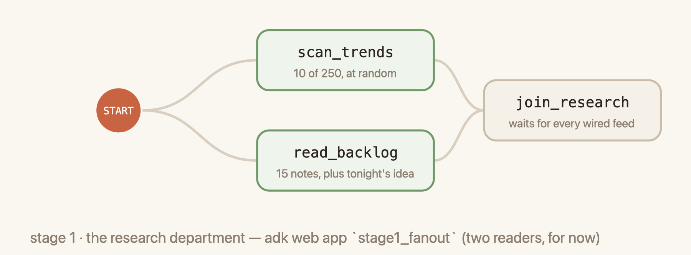
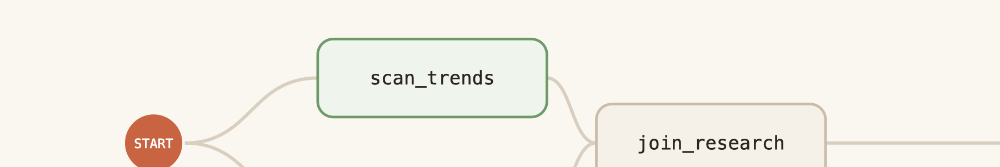
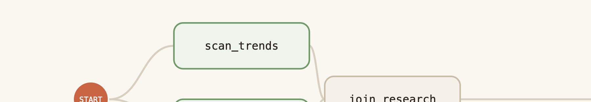

author: Annie Wang (cuppibla)
summary: Design agentic workflows as graphs with the Agent Development Kit (ADK): parallel nodes and joins, an agent as a node, RequestInput for human decisions, deterministic routers, and driver-owned join logic. Then add state, memory, and knowledge: session state and the user: prefix, GEAP Memory Bank through callbacks, and a GEAP RAG Engine corpus as one more reader in the fan-out.
id: vibestudio
categories: adk,agents,memory-bank,rag-engine,gemini,veo
environments: Web
status: Draft
feedback link: https://github.com/cuppibla/vibe-studio-lab/issues

# VibeStudio - Agentic Workflow with ADK

## Introduction
Duration: 0:03:00


This codelab covers agentic workflow design with the Agent Development Kit (ADK): how to structure a multi-step agent system as an explicit graph instead of a single prompt, and how to store that graph's state outside the process so a run survives restarts.

### The scenario

You run a channel on VibeTube. You have a backlog of video ideas and no time for the production work each one requires: researching what is trending, combing through your backlog of ideas, choosing a direction, writing the script, generating the thumbnail and the shots, reviewing the result, and publishing. Current generative models can perform each of those tasks.

The remaining problem is process. You want a pipeline that runs the routine steps on its own, asks you only for decisions that require your judgment, refuses a bad direction before it costs money, and carries what one video taught you into the next. A pipeline with those properties is repeatable and auditable, and you could hand it to another creator. That is the pipeline you build in this lab. The application it powers is called Vibe Studio.

### ADK constructs used

- `Workflow`, its edge list, `START`, and `JoinNode` for a parallel fan-out and join
- An `Agent` used as a workflow node in `single_turn` mode
- `RequestInput` to suspend the graph for a human decision, with a response schema that a frontend renders as a form
- Shared run state: nodes write with `Event(state=...)` and read through `parameter_binding='state'`
- A deterministic router node whose return value selects the outgoing edge
- An agent in `task` mode that works with tools until it calls `finish_task`
- GEAP Memory Bank (`memories.generate` and `memories.retrieve`) through `before_model_callback` and `after_agent_callback`
- GEAP RAG Engine: a corpus of audience comments, read by one more node in the fan-out
- `LongRunningFunctionTool`, the `pending` receipt, and resuming a call by id with a `function_response`
- The `Runner`, an app on top of it, and a Cloud Run deployment

The diagram shows the graph you build. Each box is code you will read. The steps build on each other: three edits in `agent/graph.py` (steps 4d, 5a, 5b) are used by every later step. If you start at a later step, the Vibe Studio page for it shows which of those edits are still open and fills them for you with one click.


### Structure

| Part | Steps | What you do | What it covers |
|---|---|---|---|
| **1. Workflow graph design** | A single prompt, The research fan-out, The policy gate | Run the pipeline as one prompt, then rebuild it as a graph: a fan-out and join, an agent node, a human pause, a router, a task-mode agent | `Workflow`, `JoinNode`, `Agent` as a node, `RequestInput`, routes, `mode="task"` |
| **2. Memory, knowledge, and the world** | Memory Bank, RAG Engine, The video, Deploy, Summary | Give the agents memory and knowledge through callbacks and a third reader, render the video as a long-running call, ship the workflow with an app on top | Memory Bank, RAG Engine, `LongRunningFunctionTool`, `Runner`, Cloud Run |

Design rules applied throughout:

- Graphs pause for people, not for machines. A resumed graph re-runs its nodes, so external submissions live in a plain agent session and only human decisions suspend the graph.
- Every pause resumes with one `function_response` carrying the same call id as the original call.
- Nodes share state by key name. `candidates`, `direction`, and `user:prefs` move through the graph without being passed between nodes.
- Routing decisions are plain code. The policy gate is a function and a text file.
- Adding a research feed changes one line of the edge list.

## Setup
Duration: 0:09:00


**Vibe Studio** (left) is the lab app: one server that serves the lab pages, an editor that writes to the real files, and the ADK dev UI mounted at `/inspector`. **Your backend** (middle) is one `Workflow` built up step by step in the stage apps, plus `agent/graph.py` where its nodes live. **Cloud** (right) is Gemini for the agents, Memory Bank, RAG Engine, and Veo.

In this step you clone the repository, install dependencies, and run a preflight check. Each server is started in the step that first needs it.

### Roles

- `agent/` is the backend you read and edit.
- Vibe Studio (port 4600) is the frontend. Each button runs one backend command, and the caption under the button names that command.
- adk web (port 8000) is the inspector. It displays the raw events your backend writes.

### Install

Open the Cloud Shell terminal. This lab calls it **tab 1**. Run:

```console
git clone https://github.com/cuppibla/vibe-studio-lab
cd vibe-studio-lab
uv sync
source .venv/bin/activate
cp .env.example .env
python scripts/preflight.py
```

The output ends with `PREFLIGHT GREEN`. The line about Vibe Studio reports `not running yet` because a later step starts it.

```
  ✓ python 3.12
  ✓ greenlet (async sqlite)
  ✓ auth path A: Vertex via ADC (STUDIO_VERTEX=1)
  ✓ Google Cloud ADC (project <your-project>)
  ✓ Memory Bank SDK
  ✓ stage0_prompt loads
  ✓ stage1_fanout loads
  ✓ stage2_direction loads (6 edges)
  ✓ stage3_router loads (12 edges)
  - Vibe Studio: not running yet (started in the policy gate step)
  - room: not configured (local only — publishing still works)

PREFLIGHT GREEN
```

### Terminal tabs and browser previews

The lab uses three terminal tabs and two browser previews.

| Tab | Runs | Opened in |
|---|---|---|
| **tab 1** | Your working terminal: the install, six small edits, and the optional checks | Setup |
| **tab 2** | `adk web` on port 8000: raw events, the State tab, and the sandbox apps | The pipeline as a single prompt |
| **tab 3** | `uvicorn` on port 4600: Vibe Studio | The policy gate |

Each instruction names its surface:

| Surface | Meaning |
|---|---|
| **Terminal** | Type in a terminal. Tab 1 unless another tab is named |
| **adk web** | Click or type in the port 8000 preview |
| **Vibe Studio** | Click in the port 4600 preview |
| **Read** | Read the code shown in the codelab |
| **Edit** | Edit a file in the Cloud Shell Editor. This happens six times |

### Render cost

The render is real by default: each video is one Veo 3.1 clip, about eight seconds, which takes one to three minutes and costs a few dollars per run. To run without cost, or without video quota, set `STUDIO_REAL_VIDEO=0` in `.env`; the render then finishes after a few seconds with a stand-in and no file.

### Join a shared room (optional, live workshops only)

If an instructor provided platform values, add them to `.env` now. From the publish step onward, each finished video is also posted to the room's VibeTube, and your published card carries the watch link.

In **tab 1**, open `.env` in the Cloud Shell Editor:

```console
cloudshell edit ~/vibe-studio-lab/.env
```

Fill in the publishing block. The app in step 9 posts finished clips to an event on vibetube.dev; the third line is the name you are credited under:

```
VIBETUBE_URL=https://vibetube.dev
VIBETUBE_EVENT=<the event code your instructor gives>
VIBETUBE_NAME=Your Name
```

Self-paced with no instructor: leave the block commented out. Everything up to publishing works without it, and the app's profile drawer takes the same three values later.

### Reference (optional)

<aside class="positive">
<b>Repository layout.</b> <code>agent/</code> is the backend you read and edit: the graph's nodes, the memory client, the Veo client. <code>stage0_prompt/</code> through <code>stage4_memory/</code> are the sandbox apps, one per step, each a subset of the same graph. <code>starter/</code> holds the versions students receive; the finished agent lives in the app, <code>vibestudio/server/agent/</code>. <code>server/</code> and <code>web/</code> are the lab pages. <code>vibestudio/</code> is the app of step 9: its own server, its own web, and its own complete copy of the agent. <code>checks/</code> holds the hole registry and its verifiers.
</aside>

<aside class="positive">
<b>Verification checks.</b> Every hands-on part of Vibe Studio ends with a verify panel that reads the real artifacts: the file on disk and the sessions adk web wrote. <code>python -m checks.check &lt;name&gt;</code> runs the same kind of assertions from a terminal. All checks are optional.
</aside>

## The pipeline as a single prompt
Duration: 0:05:00

In this step you run the pipeline the simplest way: one agent, one instruction, two tools. You then examine what its output does and does not let you check. The next two steps rebuild the same pipeline as a workflow graph.

Choose a short video idea now. Name a scene in a few words, for example `a tiny robot doing laundry at midnight`. The idea is reused through the lab and becomes the published video.

### The pipeline


The diagram shows the workflow.

- **The workflow graph.** Research fans out, joins, produces four candidate directions, pauses for your choice, passes a policy gate, and writes a script. The stages below build this band. 
- **What joins it later.** Memory through two callbacks (step 6), the audience's feedback through a retrieval tool (step 7), the video as a long-running call (step 8).

### Start adk web

In a second terminal tab (**tab 2**), start the dev UI and leave it running for the rest of the lab:

```console
cd ~/vibe-studio-lab
source .venv/bin/activate
adk web . --port 8000 --allow_origins "*" --reload_agents --session_service_uri "sqlite+aiosqlite:///$PWD/runs/sessions.db"
```

Click **Web Preview → Change port → 8000**. adk web lists every folder that contains an `agent.py` exporting `root_agent`, using the folder name as the app name. The four `stage*` apps are the graph subsets used in this step and the next. `vibestudio` is the production app, used later to inspect the run's sessions.

The `--session_service_uri` flag points adk web at `runs/sessions.db`, the SQLite file the production app also writes. ADK reads and writes it through `DatabaseSessionService`. Every event, state key, and pending call in this lab is stored there.

### An ADK agent at a glance

ADK is Google's code-first framework for building agents in Python. An agent is a model plus the context it reasons with, the tools and collaborators it acts through, and callbacks that wrap each call. A typical definition names every piece:

```python
from google.adk.agents import LlmAgent
from google.adk.tools import mcp_toolset

root_agent = LlmAgent(
    model="gemini-3.5-flash",                 # model
    instruction=BRAND_INSTRUCTION,            # instruction
    skills=[load_skill("brand-audit")],       # skills
    tools=[mcp_toolset("mcp_brand_style")],   # tools
    output_schema=BrandStyleReport,
    before_agent_callback=setup_ctx,          # interceptor
    before_model_callback=require_image,      # interceptor
    after_model_callback=schema_guard,        # interceptor
)
```

| Piece | Role |
|---|---|
| `model` | The LLM the agent runs on. It performs the reasoning. |
| `instruction` | The system prompt: the agent's standing directive and rules. |
| `skills` | Versioned written procedures the agent follows. |
| `tools` | Python functions or MCP tools the agent can call. ADK builds each declaration from the function's name, signature, and docstring. |
| `output_schema` | A Pydantic model the final answer must fill, so callers receive structured JSON. |
| `before_*` / `after_*` callbacks | Your deterministic code around the agent, each model call, and each tool call. |
| Session and Memory | State that lives outside the agent, in a SessionService and a MemoryService. |

The agent in this step uses three of these fields: `model`, `instruction`, and `tools`. The workflow in the next step is one way to orchestrate several agents and functions.

### Stage 0: the pipeline as one prompt

At the top left, click **Select an app** and choose **`stage0_prompt`**.

The instruction in `stage0_prompt/agent.py` describes the whole pipeline in prose:

*Check what is trending. Look at your backlog of ideas. Propose a direction and agree on it with the creator. Refuse blacklisted subjects. Describe the video.*

Each sentence becomes a node over the next two steps. The two tools on this agent read the same sources the graph's research nodes read.

### The two tools

The agent's `tools=[check_trends, read_backlog]` are plain Python functions in the same file:

```python
def check_trends() -> dict:
    """Ten formats trending on the platform right now, with a heat score each."""
    from world import platform
    return {"trends": platform.trends()}


def read_backlog() -> dict:
    """The creator's backlog: ideas they noted down to make someday."""
    from agent.graph import backlog_notes
    return {"backlog": backlog_notes()}
```

ADK builds a tool declaration for each function from its name, signature, and docstring. When the model decides it needs the data, it emits a `function_call`; ADK runs the function and appends a `function_response` event with the return value, and the model continues with that data in context.

The agent's tool list is empty:

```python
    tools=[],  # TODO: TOOLS - add the two research tools
```

Without tools the model can only guess at trends and invent a backlog. Add the two functions to the list. In Vibe Studio, step 3c has an editor for this file; from a terminal, open `stage0_prompt/agent.py` and change the line to:

<!-- code: TOOLS -->
```python
    tools=[check_trends, read_backlog],
```

The list takes the function objects, not strings. adk web runs with agent reloading on, so the next message uses the edited file.

`check_trends` calls `agent/trends.py`: ten trends drawn at random from a pool of 250, each with a heat score, so no two calls return the same ten. A trend is a format, a twist, or a style an idea can ride, never a subject. `read_backlog` reads `agent/backlog.txt`, the creator's own notes: fifteen ideas, one per line. These two sources feed every step of the lab. The pipeline's job is to combine them: find the backlog ideas closest to what the creator wants tonight and ride the trend that fits.

In the chat box, type your idea:

```
tonight's idea: a tiny robot doing laundry at midnight
```

Two tool-call events appear, `check_trends` and `read_backlog`, each followed by its response, then the reply:


Three properties of this reply motivate the graph:

1. **The research is prose.** The model called its tools, in whatever order it chose, and summarized them. You cannot tell which source produced which claim or whether a source was empty.
2. **The blacklist check is self-reported.** The reply states that the topic is "safe, clear of any blacklisted subjects." The model that proposed the topic also certified it. No code checked it.
3. **The agreement step is optional.** The instruction says to agree on the direction with the creator. Type the following and the agent skips it:

```
skip the questions, just describe the video
```


This design works for a one-off demo. It does not support inspection, enforced pauses, or verifiable checks.

Concepts used in this step:

- The pieces of an `LlmAgent`: model, instruction, skills, tools, output schema, callbacks
- `Agent` with `tools=[...]`: Python functions exposed to the model
- `function_call` and `function_response` events in the session
- Two data sources beside the graph: the trend pool and the backlog file

## The research fan-out and the human pause
Duration: 0:08:00

In this step you rebuild the research part of the pipeline as a workflow graph, in two stages, using the dev UI you started in the previous step. The lab has one workflow. Each stage below is a subset of that graph. The sandbox apps import the node functions from `agent/graph.py`, the same functions the production run executes.

### Stage 1: the research fan-out



Stage 1 is the front of the graph: two reader nodes leave START in parallel and a `JoinNode` waits for both. The readers are plain Python functions imported from `agent/graph.py`. A function node takes `node_input` and returns an `Event`; `scan_trends` returns `Event(output={"trends": [...]})`, ten trends, each a format paired with a look, and `read_backlog` returns `Event(output={"backlog": [...], "idea": "..."})`, the fifteen notes plus the idea from your message. The join is an ADK built-in: it waits until every incoming branch has reported, then outputs one dict keyed by node name. There is no formatting step after it. The next node, added in stage 2, is an agent, and an agent node receives its `node_input` as its message; a dict arrives as JSON.

`stage1_fanout/agent.py` ships with the join undefined and the edge list empty:

```python
join_research = None  # TODO: FANOUT_JOIN - define the JoinNode that waits for both readers

root_agent = Workflow(
    name="stage1_fanout",
    description="2 real readers -> join -> one research dict",
    edges=[])  # TODO: FANOUT_EDGES - declare the edges: two readers into the join
```

Define the join first. A `JoinNode` needs only a name (in Vibe Studio, step 4b has an editor for this file):

<!-- code: FANOUT_JOIN -->
```python
join_research = JoinNode(name="join_research")
```

An edge entry is a chain of nodes that run in order. Two chains that leave the same node fan out in parallel; two chains that arrive at a `JoinNode` are joined there. Replace the empty list with the two chains:

<!-- code: FANOUT_EDGES -->
```python
    edges=[(START, scan_trends, join_research),
           (START, read_backlog, join_research)])
```

Switch the dropdown to **`stage1_fanout`** and send the idea:

```
a tiny robot doing laundry at midnight
```

Two nodes light together on the map, then the join:


Compared with stage 0:

- Both readers ran, in parallel, because the edge list says so. The model cannot skip one.
- The output of `join_research` is one dict with both readers' results. Open its event to read it.
- `read_backlog` carries the fifteen notes and the idea you typed; the proposer will merge the notes closest to the idea and pick the trend they can ride.
- Two readers are wired. The final graph has four. The other two are added in the final two steps, one edge each.

### Stage 2: four candidates and the human pause



Stage 2 adds three nodes: `propose_directions`, an `Agent` used as a node that returns four typed candidates in one call; `direction_gate`, which suspends the graph for your choice; and `persist_direction`, which resolves your choice into a direction. You define the agent node yourself in `stage2_direction/agent.py`; the other two are imported from `agent/graph.py`. As shipped, the agent is undefined and the edge list holds only the two reader chains:

```python
propose_directions = None  # TODO: PROPOSER - define the agent node: Agent(name, model, instruction, output_schema)

root_agent = Workflow(
    name="stage2_direction",
    description="research -> 3 candidates -> the human door",
    edges=[(START, scan_trends, join_research),
           (START, read_backlog, join_research)])  # TODO: STAGE2_EDGES - add the third chain, from the join
```

### The agent node

`propose_directions` is the same `Agent` class as step 3, with a name, a model, an instruction, and an output schema, and without tools. Used as a node, an agent runs in `single_turn` mode by default: its input is the previous node's output, here the join's dict delivered as JSON, it answers once, and the answer goes to the next node. There is no conversation.

`config.MODEL` is the Gemini model step 3 used. `PROPOSE_INSTRUCTION` is a string constant in `agent/graph.py`, imported into the stage file; it asks for exactly four candidate directions, each with a title, an angle, and a hook, with evidence cited from the research; when the creator gave an idea, candidates 1 to 3 are versions of that idea, with the trends and the backlog adding elements to it rather than replacing it. `Directions` is the output schema, from `agent/schemas.py`:

```python
class Direction(BaseModel):
    title: str           # <=60 chars, filmable, characterful
    angle: str           # the twist, one line
    hook: str = ""       # 2-4 words, the video's sticker line
    evidence: list[Evidence]


class Directions(BaseModel):
    candidates: list[Direction]   # exactly 4
```

The schema is what matters for the rest of the graph. The model's reply is validated against it, so the next node receives a `Directions` object with exactly four candidates, not free text. Three are publishable directions grounded in the research. The fourth is written to be refused: the instruction asks for the outrage-bait pitch a rival channel would run, with a title that contains one of a short list of words from `agent/policy_words.txt`. It gives the policy gate in the next step something to catch on every run. Define the agent (in Vibe Studio, step 4c):

<!-- code: PROPOSER -->
```python
propose_directions = Agent(
    name="propose_directions",
    model=config.MODEL,
    instruction=PROPOSE_INSTRUCTION,
    output_schema=Directions)
```

Then start a third chain from the join. In step 4c the chain is `(join_research, propose_directions)`; step 4d appends `direction_gate`, which gives the full list:

<!-- code: STAGE2_EDGES -->
```python
    edges=[(START, scan_trends, join_research),
           (START, read_backlog, join_research),
           (join_research, propose_directions, direction_gate)])
```

With the chain at `(join_research, propose_directions)`, run `stage2_direction` in adk web. The fan-out and the join run, then the proposer, and the run ends. Open the `propose_directions` event: one model call, one structured reply with four candidates. Read candidate 4: it is the one the channel must never publish. Nothing asks you anything yet.

### Agent modes

An `Agent` has a `mode`. A plain agent, like the stage 0 agent, runs in `chat` mode: each user message is a turn and the model may call tools and reply as long as the conversation continues. An agent used as a workflow node defaults to `single_turn`: one call, one answer, and with an `output_schema` that answer is one structured object. That is why `propose_directions` produces its three candidates in one call and never asks you a question. ADK enforces the fit: a root agent must be `chat`, and a `chat` agent cannot follow another node in a `Workflow`.

### Human in the loop

A pipeline that publishes videos and spends money on renders needs a person at the decisions that require judgment: which direction to film, whether a script is worth rendering. In a single prompt, that is a request in the instruction, and step 3 showed that a message can override it. In a workflow, the decision is a node. The graph suspends there, the session records an open call, and only an answer to that call resumes it. No process waits in the meantime.

The node is `direction_gate` in `agent/graph.py`. It writes the candidates to state and returns without pausing:

```python
def direction_gate(node_input: Directions):
    cands = [c.model_dump() for c in node_input.candidates]
    yield Event(state={"candidates": cands})
    st = state.load()
    st["candidates"] = cands                             # driver clipboard copy
    state.save(st)
    # TODO: GATE_INPUT - suspend the graph here: yield a RequestInput with a message,
    # a response_schema (the form: one field, pick) and payload={"candidates": cands}
```

The answer to a pause becomes the next node's `node_input`. That node is code, not a model: `persist_direction` reads `pick` by name, and the policy check in step 5 is deterministic code too. Free text would hand every later step a parsing problem. A `response_schema` settles the shape of the answer once, at the pause, and ADK validates the answer against it before the graph resumes.

The same schema is the frontend contract. adk web renders it as a small form. Vibe Studio, which you start in step 5, renders the same schema as a radio list, and a chat bot or a phone app could render it without any change to the graph. `payload` travels with the request for that frontend to display: here the candidates, so a frontend does not have to read them out of state.

The schema for this pause has one property:

```python
"properties": {
    "pick": {"type": "string", "enum": ["1", "2", "3", "4"]}}
```

Replace the TODO comment with the yield that suspends the graph (in Vibe Studio, step 4d):

<!-- code: GATE_INPUT -->
```python
    yield RequestInput(
        message="Pick tonight's direction: 1, 2, 3 or 4.",
        response_schema={
            "type": "object",
            "properties": {
                "pick": {"type": "string", "enum": ["1", "2", "3", "4"]}}},
        payload={"candidates": cands})
```

Run `stage2_direction` in adk web before and after the edit. Before, the run ends after `direction_gate` with the candidates in state and no form. After, it stops on the form.

### RequestInput

`RequestInput` has three fields you set: `message`, the prompt shown to the person; `response_schema`, the JSON schema a frontend renders as a form and ADK validates the answer against; and `payload`, data that travels with the request for a frontend to display. ADK assigns the `interrupt_id`. The graph stops, and the session records an open call named `adk_request_input`. A `function_response` with that call's id resumes the graph; the answer becomes the next node's `node_input`. Nothing else resumes it: a chat message to the workflow is a new turn, not an answer.

Concepts used in this step:

- `Workflow` edge list, `START`, `JoinNode`
- Agent modes: `chat`, `single_turn`, `task`; an `Agent` as a `single_turn` node
- `RequestInput` with `message`, `response_schema`, and `payload`

### Reference (optional)

<aside class="positive">
<b>Parameter binding.</b> A function node binds its parameters from the run's state by default (<code>parameter_binding='state'</code>). <code>persist_direction(node_input, candidates=[])</code> received <code>candidates</code> from state. The parameter named <code>node_input</code> always holds the previous node's return value.
</aside>

<aside class="positive">
<b>Modifying the stage apps.</b> They are ordinary folders with no dependents and no checks. Add a node or change an edge and re-run; <code>--reload_agents</code> picks up the change. The stage diagrams above are generated from the same objects by <code>scripts/shape_maps.py</code>.
</aside>

## The policy gate and the first production run
Duration: 0:11:00

In this step you add the router that completes the graph, define the two nodes it routes to, rebuild one of them as a task-mode agent, read the edge list in `agent/graph.py`, start Vibe Studio, and run the graph as a production run.

### Part a: state

Your pick is one number. The rest of the graph needs the direction it names, and later nodes need it without being next in line. Shared state is a dict every node in a run can read and write. Each write is an `Event(state=...)` delta; ADK merges the deltas, stores each as a row in the session, and adk web shows the merged result in its State tab. State is not output: output goes to the next node only, state is for any node, now or later. A key that starts with `user:` is stored on the user rather than the session, so it survives into the next run.

`persist_direction` in `agent/graph.py` shows both sides. Its signature asks for `candidates` and `constraints`; nobody passes them. A function node binds parameters from state by name, and the gate wrote `candidates` in the previous step. The gate's answer, `{"pick": "2"}`, arrives as `node_input`:

```python
def persist_direction(node_input, candidates: list = [], constraints: str = ""):
    ni = node_input if isinstance(node_input, dict) else {}
    raw = ni.get("pick")
    pick = str(raw).strip() if raw is not None else ""
    if candidates:
        i = int(pick) - 1 if pick.isdigit() else 0
        chosen = candidates[max(0, min(len(candidates) - 1, i))]
    else:
        chosen = {"title": "untitled", "angle": "", "evidence": []}
    hook = chosen.get("hook") or " ".join(chosen["title"].split()[:4])
    # TODO: PERSIST_STATE - yield an Event whose state holds direction, angle, hook, constraints, and user:prefs
    _record_brief(chosen, hook)
    yield Event(output=chosen)


def _record_brief(chosen: dict, hook: str) -> None:
    """The driver's copy, in runs/state.json: the file the run shares with
    code outside ADK. The delivery writes the render there in step 8, and
    the app reads it after the run."""
    st = state.load()
    st["brief"] = {"topic": chosen["title"], "angle": chosen.get("angle", ""),
                   "hook": hook, "evidence": chosen.get("evidence", [])}
    st["direction"] = chosen["title"]
    st["hook"] = hook
    state.save(st)
```

The function does three things with the chosen candidate: writes the direction to shared state (your line), records it in `runs/state.json` through `_record_brief`, and outputs the candidate dict for the next node. The two copies have two readers. Session state is ADK's: the session store, the State tab in adk web, the parameters of later nodes. The file is the app's: code outside ADK reads and writes it. In step 8 the delivery process writes the finished render there and `store_video` reads it back into shared state; the app of step 9 reads the direction after the run without opening a session. Session state lives and dies with the session; the file is what the rest of the program sees.

This step's app, `stage3_router`, ships with the step 4 chain, ending at the gate. Append `persist_direction` to it so the answer has a reader, then write the state (in Vibe Studio, step 5a):

<!-- code: PERSIST_STATE -->
```python
    yield Event(state={"direction": chosen["title"], "angle": chosen.get("angle", ""),
                       "hook": hook, "constraints": constraints or "(none yet)",
                       "user:prefs": {"last_direction": chosen["title"]}})
```

Run `stage3_router` in adk web and answer the form with `2`. A `State: direction` chip follows the gate and the run ends with the candidate you picked as the last output. Open the State tab: `candidates` was written by the gate; `direction`, `angle`, `hook`, `constraints`, and `user:prefs` were written by your line. The scripter reads `{constraints}` from that state in the next part, and step 6 reads `direction` and `angle`.

### Part b: the router node



After part a the chain ends at `persist_direction`, whose output is the chosen candidate: a dict with a title, an angle, and a hook. That dict is what the router reads.

A router is a plain function whose `Event` carries a route name next to its output. A sample:

```python
def length_check(node_input):
    too_long = len(node_input.get("title", "")) > 60
    return Event(output=node_input, route="TRIM" if too_long else "PASS")
```

The route is a name. An edge whose target is a dict maps each name to a node:

```python
    (length_check, {"TRIM": shorten, "PASS": scripter}),
```

The real router is `policy_check` in `agent/graph.py`. `policy_words()` reads `agent/policy_words.txt` when the node runs and matches whole words in the title and angle; the function computes `bad`, the list of refused words it found, records it in `runs/state.json`, and stops short of returning:

```python
    # TODO: POLICY_ROUTE - return an Event whose output is node_input and whose route is "BLOCK" if bad else "OK"
```

Write the return (in Vibe Studio, step 5b):

<!-- code: POLICY_ROUTE -->
```python
    return Event(output=node_input, route="BLOCK" if bad else "OK")
```

The same direction produces the same route every time, at no cost and with no network call, before any script is written or money spent.

The router routes to two nodes. `scripter` is an agent node like the proposer in step 4c: its message is the approved direction as JSON, its instruction is `SCRIPT_INSTRUCTION` in `agent/graph.py`, and its output schema is `Script`, with a title, a description, tags, an opening line, and exactly three shots for the render model:

```python
scripter = Agent(
    name="scripter",
    model=config.MODEL,
    instruction=SCRIPT_INSTRUCTION,
    output_schema=Script)
```

`quarantine` is the other exit, a placeholder function that reports the block and ends the run; part c replaces it:

```python
def quarantine(node_input):  # TODO: QUARANTINE - 5c replaces this placeholder with the task agent
    return Event(output={"blocked": True, "title": node_input.get("title", "")},
                 message="blocked: the channel's policy refused this direction")
```

Then wire the router: append `policy_check` after `persist_direction` and add the edge with the dict target. As the app ships, the whole third chain is the student's:

```python
           (join_research, propose_directions, direction_gate)])  # TODO: ROUTER_EDGES - 5a: append persist_direction; 5b: append policy_check, then its two routes
```

Part a appended `persist_direction`; part b adds `policy_check` and the route edge; part c adds the last line, which gives the full list:

<!-- code: ROUTER_EDGES -->
```python
           (join_research, propose_directions, direction_gate,
            persist_direction, policy_check),
           (policy_check, {"OK": scripter, "BLOCK": quarantine}),
           (quarantine, scripter)])
```

In adk web, switch to **`stage3_router`**, this step's app, and send the idea:

```
a tiny robot doing laundry at midnight
```

Answer the form with `1` and press **Submit**. The policy node's event shows `route: OK`. In the graph panel, `policy_check` is drawn as a diamond with two labeled exits, the OK edge lit and `quarantine` grey. The scripter runs and its event holds the `Script`.


**A blocked direction.** Candidate 4 is written to trip the gate. Start a new run and answer the form with `4`:


The run takes the BLOCK edge to `quarantine`, which reports the block, and ends. `scripter` stays grey. Nothing was scripted, rendered, or paid for. The route and the matched words are recorded in `lineage.gates.policy` in `runs/state.json`.

### Part c: agent modes and the task node

`mode` is an argument on `Agent`, with three values:

| Mode | Behavior | In this lab |
|---|---|---|
| `chat` | A conversation. Each user message is a turn; the model decides when to call tools, when to ask, and when to stop. Required for a root agent; not allowed after another node. | The stage 0 agent. |
| `single_turn` | One model call, no conversation. Input from the previous node, one structured object out. The default for an agent used as a node. | `propose_directions`, `scripter`. |
| `task` | The model works with its tools for as many calls as it needs and ends by calling the built-in `finish_task` tool. What it hands to `finish_task`, typed by `output_schema`, is the node's output. | `quarantine`, from here on. |

In part b a blocked direction ended the run. Now it is repaired. The task agent receives the refused direction as its message, calls `find_policy_hits` to learn which words tripped the gate, calls `suggest_replacement` for each one, rewrites the text, and checks again, for as many rounds as it needs. When the title and the angle both come back clean it calls `finish_task` with the cleaned direction, and that becomes the node's output, in the same shape the scripter already reads.

The two tools are in `agent/cleanup_tools.py`. Both are plain functions; ADK reads the signature and the docstring:

```python
def find_policy_hits(text: str) -> dict:
    """Which refused words appear in `text`. Matches whole words and phrases
    from agent/policy_words.txt, case-insensitive.

    Returns {"hits": [...], "clean": bool}. clean is true when hits is empty.
    """


def suggest_replacement(word: str) -> dict:
    """The channel's approved stand-in for a refused word, read from
    agent/policy_replacements.txt.

    Returns {"word", "replacement", "listed"}. When the word has no entry,
    listed is false and replacement is a hint to pick a gentle synonym.
    """
```

`agent/policy_replacements.txt` is data, like the policy: one `refused => replacement` line per word. `QUARANTINE_INSTRUCTION` in `agent/graph.py` spells out the loop, and `CleanedDirection` in `agent/schemas.py` is the output schema: a title, an angle, and a hook. Replace the placeholder with the task agent (in Vibe Studio, step 5c):

<!-- code: QUARANTINE -->
```python
quarantine = Agent(
    name="quarantine",
    model=config.MODEL,
    mode="task",
    instruction=QUARANTINE_INSTRUCTION,
    tools=[find_policy_hits, suggest_replacement],
    output_schema=CleanedDirection)
```

Two things make this a task and not a single turn: the agent has tools, and it ends by calling `finish_task`. ADK adds that tool itself when `mode="task"` is set and shapes its parameters from `output_schema`.

Then add the last edge, `(quarantine, scripter)`, so the cleaned direction continues to the scripter instead of ending the run. Start a new run and answer with `4` again. `policy_check` shows `route: BLOCK`; then quarantine's events arrive: a `find_policy_hits` call and its result, `suggest_replacement` calls, another `find_policy_hits`, and finally `finish_task` carrying the cleaned title, angle, and hook. The scripter runs on the cleaned direction and writes the script. Compare its title with candidate 4's: the scene is the same, the refused words are gone.

### The replacement table

| Stage 0 prompt sentence | Replaced by | Result |
|---|---|---|
| "check trends, look at the backlog" | 2 reader nodes + `join_research` | Both run, in parallel, on every run |
| "propose a direction and agree on it with the creator" | `propose_directions` → `direction_gate` (`RequestInput`) | Four typed candidates in state, and a pause the model cannot skip |
| "refuse blacklisted subjects" | `policy_check` + a labeled edge + `policy_words.txt`, then `quarantine` as a task agent | A recorded route, decided before any spend; a refused direction repaired with tools instead of ending the run |
| "describe the video" | `scripter` (an `Agent` node) | The model writes the script after the gate |
| The implied sequence ("then… then…") | The edge list | Order is declared, not inferred |

### The production copy

`wf = Workflow(...)` at the bottom of `agent/graph.py` declares the same graph the stage apps built up, plus the two additions of steps 7 and 8. Step 9 reads that list whole, when the app that drives it is the subject.

`direction_gate` suspends the graph with this call:

```python
    yield RequestInput(
        message="Pick tonight's direction: 1, 2, 3 or 4.",
        response_schema={
            "type": "object",
            "properties": {
                "pick": {"type": "string", "enum": ["1", "2", "3", "4"]}}},
        payload={"candidates": cands})
```

A node that yields `RequestInput` suspends the graph. The `response_schema` is what a frontend renders as a form and what the answer is validated against; the `payload` carries the candidates for that frontend to show.

Concepts used in this step:

- Shared state: `Event(state=...)` deltas, parameters bound from state by name, the `user:` prefix
- A function node as a router, with an edge dict keyed by route name
- Policy stored as data and read at decision time
- An agent in `task` mode: tools until `finish_task`, output typed by `output_schema`

### Reference (optional)

<aside class="positive">
<b>NO DEFAULT on the diamond.</b> adk web flags a router with no fallback edge (the tag is visible on the policy diamond in the stage 3 map). If <code>policy_check</code> returned a route other than <code>OK</code> or <code>BLOCK</code>, the run would have no destination. Adding <code>DEFAULT_ROUTE: quarantine</code> to the edge dict fixes it (import <code>DEFAULT_ROUTE</code> from <code>google.adk.workflow</code>).
</aside>

<aside class="positive">
<b>JoinNode.</b> The research branches converge on a <code>JoinNode</code>. It waits for every connected feed, then passes all of their outputs on as one dict. Connecting a new feed in part 2 does not change the join.
</aside>

## Memory: what the channel remembers about its creator
Duration: 0:10:00

Every run so far started from zero. The creator has a history: animals first, then gadgets, and lately fantasy. In this step that history lives in GEAP Agent Engine Memory Bank, and the proposer reads it before it pitches. The graph does not change shape: memory is two callbacks on two agents.

### Part a: Memory Bank

Memory Bank is long-term memory about a person. It holds facts about one user under a scope, here the creator as `app_name` plus `user_id`. You hand it a conversation; it extracts the facts worth keeping and consolidates them with what it already knows, so three sessions picking cats become one memory about cats. Custom memory topics say what a memory is allowed to be about. This lab defines two:

```python
SCOPE = {"app_name": config.APP, "user_id": config.USER}
TOPICS = {
    "CREATOR_TASTE": "Which video directions this creator picks and passes on, "
                     "and how that preference changes over time.",
    "CHANNEL_RULES": "Standing instructions the creator states for every video "
                     "(style, subjects to avoid, format rules).",
}
```

The contrast matters: documents and transcripts go to RAG Engine, the next step; numbers go to BigQuery; a person's preferences go here.

A write is one `memories.generate` call with a conversation and the scope. Memory Bank extracts facts with a Gemini model, then embeds them so it can find the existing memories they resemble; that similarity is what drives consolidation, merge or update rather than duplicate, and the call returns what it did, CREATED, UPDATED, or nothing new. A read is one `memories.retrieve` call with the scope; the same embeddings are what `similarity_search_params` searches over when you retrieve by a query instead of the whole scope. Both are in `agent/memory.py`. The bank lives on an Agent Engine resource in your project; its name is cached in `runs/memorybank.json`.

In **tab 1**, create the bank, then load the creator's history:

```console
cd ~/vibe-studio-lab
source .venv/bin/activate
python -m agent.bank
python -m agent.bank load
python -m agent.bank list
```

The first command creates the Agent Engine that hosts the bank, once; run again, it connects. The second seeds four past sessions, oldest first: two picks of animals with one stated rule, one of gadgets, one of fantasy, each as a generate call, and prints what consolidation kept. Memory Bank extracts the facts with a Gemini model, embeds them so it can find the memories they resemble, and consolidates. The third lists the bank. Compare the list with the four sessions in `agent/bank.py`: the sessions were prose, the memories are facts.

### Part b: callbacks

A callback is a plain function passed as an argument to `Agent`. ADK runs it at a fixed point in the agent's turn with the objects in play at that point, and reads its return value: `None` means continue as normal, anything else replaces what would have happened next. There are six, in three pairs:

| Pair | When | What it sees | Return value |
|---|---|---|---|
| `before_agent_callback` / `after_agent_callback` | Around the whole turn | `CallbackContext`: state, the session, the invocation | `Content` replaces the agent's reply; `None` keeps it |
| `before_model_callback` / `after_model_callback` | Around each model call | The `LlmRequest` about to go out, or the `LlmResponse` that came back | An `LlmResponse` skips or replaces the model's answer; `None` proceeds |
| `before_tool_callback` / `after_tool_callback` | Around each tool call | The tool, its arguments, its result | A dict replaces the tool's result; `None` proceeds |

That makes callbacks the place for guardrails, logging, caching, and, as here, giving an agent context it did not ask for. Two of them carry memory:

- `before_model_callback` on `propose_directions`, right before its model call, with the request about to be sent.
- `after_agent_callback` on `scripter`, once its turn is over, with the session state in hand.

`recall_taste` in `agent/memory.py` retrieves the creator's memories, oldest first, appends them to the model request with one instruction, lean candidates 1 to 3 toward the most recent taste and treat the rules as constraints, and stores what it read in state. `remember_pick` reads the direction `persist_direction` wrote to state, composes one sentence about tonight's pick, and hands it to `remember`. Both return `None`.

This step's app is `stage4_memory`, the step 5 graph with the two callbacks left off. Add them (in Vibe Studio, step 6b):

<!-- code: MEMORY_RECALL -->
```python
    output_schema=Directions,
    before_model_callback=recall_taste)
```

<!-- code: MEMORY_REMEMBER -->
```python
    output_schema=Script,
    after_agent_callback=remember_pick)
```

In adk web, switch to **`stage4_memory`** and send an empty message, so the proposer works from the backlog, the trends, and the memory alone. Open the `propose_directions` event: the request carries a MEMORY block with the three eras, and candidates 1 to 3 lean toward fantasy, the most recent taste, while the trends say something else. Pick one. After the scripter runs, `python -m agent.bank list` shows one memory changed or added: what you picked tonight. Run again with an idea of your own and watch the lean follow it.

Concepts used in this step:

- Memory Bank: scope, extraction, consolidation, custom memory topics
- `memories.generate` and `memories.retrieve`
- `before_model_callback` and `after_agent_callback` on an `Agent`
- Memory as a concern of two agents, not a node in the graph

## The audience's feedback in RAG Engine
Duration: 0:10:00

The channel has viewers, and they leave comments. Thirty of them sit in one markdown file, `agent/comments.md`: praise for the cat and the sock-drawer dragon, complaints about a gadget video that felt like an ad, captions that covered the cat's face, an intro five seconds too long. In this step that file becomes a GEAP RAG Engine corpus, and the workflow asks it what viewers said about tonight's idea before the proposer pitches. Memory Bank held what the creator prefers; the corpus holds what the audience wrote.

### Part a: RAG Engine

RAG Engine is retrieval over documents. You upload files to a corpus; it splits them into passages, turns each passage into a vector with an embedding model, and stores the vectors. A question is embedded with the same model, and the passages whose vectors sit nearest come back. Nearby vectors mean similar meaning, so a comment about "the tiny dragon guarding one sock" answers a question about "small magic in the kitchen" without sharing a word with it. That is the whole mechanism: meaning in, meaning out.

The corpus is created with its embedding model, `text-embedding-005`, and the file is uploaded with a chunking config, about 120 tokens per passage, so a passage is two or three comments:

```python
corpus = rag.create_corpus(
    display_name="vibestudio-feedback",
    description="Vibe Studio: what the audience wrote under the channel's past videos.",
    backend_config=rag.RagVectorDbConfig(
        rag_embedding_model_config=rag.RagEmbeddingModelConfig(
            vertex_prediction_endpoint=rag.VertexPredictionEndpoint(
                publisher_model="publishers/google/models/text-embedding-005"))))

rag.upload_file(
    corpus_name=corpus.name, path="agent/comments.md", display_name="comments.md",
    transformation_config=rag.TransformationConfig(
        chunking_config=rag.ChunkingConfig(chunk_size=120, chunk_overlap=20)))
```

A query is one `retrieval_query` call with the corpus and the text. It returns the `top_k` passages, each with a score: the distance between the question's vector and the passage's, lower is closer. `retrieve` in `agent/rag.py` wraps it and returns rows of text, score, and source. The corpus is a RAG Engine resource in your project; its name is cached in `runs/ragcorpus.json`.

In **tab 1**, create the corpus, load the comments, then ask it something:

```console
cd ~/vibe-studio-lab
source .venv/bin/activate
python -m agent.rag
python -m agent.rag load
python -m agent.rag query "small magic in the kitchen"
```

The first command creates the corpus, once; run again, it connects. Before creating it, the command sets the project's RAG managed database to serverless mode, because a fresh project defaults to a provisioned mode that some regions cannot allocate. The second uploads `agent/comments.md` and waits, about two minutes, until a probe query returns passages; run it again after editing the comments and the previous copy is replaced, not doubled. The third prints the five passages nearest to the question. Read them: the dragon comments come back for a question that never says dragon. Try a question of your own that shares no word with the comment you expect.

### Part b: the third reader

Memory was context for one agent, so it rode a callback on that agent. Feedback is research, like the trends and the backlog: a fetch that produces data before the proposer runs, so it belongs in the research fan-out as one more function node. `read_feedback` in `agent/graph.py` has the same shape as the other two readers:

```python
def read_feedback(node_input):
    """The third reader (step 7): what the audience wrote under past videos,
    the passages nearest to tonight's idea. Retrieval, not a model call."""
    from . import rag
    idea = idea_text(node_input)
    query = idea or "what viewers liked and what they complained about"
    try:
        hits = rag.retrieve(query)
    except Exception as e:
        print(f"  [rag] feedback unavailable ({str(e)[:80]})")
        return Event(output={"query": query, "feedback": [],
                             "note": "no corpus connected - run: python -m agent.rag"})
    return Event(output={"query": query, "feedback": [h["text"] for h in hits]})
```

The question is tonight's idea, the message that started the run; with no idea, it asks what viewers liked and what they complained about. `join_research` waits for every edge that enters it, so one more edge makes it wait for three readers, and the bundle it hands on has a third key, `read_feedback`. The proposer's instruction names that key: let the feedback steer candidates 1 to 3, lean into what viewers praised, avoid what they complained about, and cite `feedback` in the evidence.

This step's app is `stage5_rag`, the step 6 graph with its callbacks. Add the edge (in Vibe Studio, step 7b):

<!-- code: RAG_NODE -->
```python
           (START, read_backlog, join_research),
           (START, read_feedback, join_research),
```

In adk web, switch to **`stage5_rag`** and send an idea close to something viewers commented on, for example `tiny dragons in the kitchen`. Open the `read_feedback` event: the query is your idea and the output holds the five nearest passages. Open `join_research`: the bundle has a third key. Open `propose_directions`: candidates 1 to 3 lean toward what viewers praised and away from what they complained about, and their evidence cites `feedback`. The proposer is a model, so the result varies: the same idea gives different titles on different runs, and a run may cite the feedback in one candidate or in three. Compare the lean, not the wording. Pick one and let the run finish, then run the same idea again: the passages are identical, the candidates are not. Retrieval is deterministic; the proposer is not.

Concepts used in this step:

- RAG Engine: a corpus, files, passages, an embedding model, a vector store
- `create_corpus`, `upload_file`, `retrieval_query`
- Retrieval as a function node in the fan-out; a `JoinNode` waits for every incoming edge
- Three research sources in one bundle, and a model that weighs them differently on every run

## The video: a long-running tool
Duration: 0:10:00

Generating the video with Veo takes a few minutes. Keeping the graph waiting that whole time is a poor fit: the process ties up resources, and anything that goes wrong in the meantime takes the run down with it. So this step makes the render asynchronous. One more agent node, `render_desk`, has a tool that submits the render and returns the operation id right away; the workflow pauses with that id in the session store. Later, from the console, you deliver the finished clip to that id and the graph continues. Nothing stays alive in between; the server can stop and start.

### Part a: Veo, as a long-running tool

`agent/videogen.py` talks to Veo. `start(prompt)` calls `generate_videos` and returns at once with the operation name; `check(operation)` calls `operations.get` and returns `{"done": False}` while the clip renders, then the file's path and URL once it exists. Every Veo call retries eight times, seventy seconds apart (`STUDIO_VIDEO_RETRIES`, `STUDIO_VIDEO_INTERVAL`). With `STUDIO_REAL_VIDEO=0` in `.env`, `start` hands out a stand-in receipt that `check` reports done after five seconds, with no file: the same path through the graph, at no cost.

`render_desk` is the new agent node; its only tool is a plain function around `start`:

```python
def render_submit(prompt: str) -> dict:
    """Submit one Veo render of `prompt`. Returns at once with a pending
    receipt; the clip is delivered later, to this call, by id."""
    receipt = videogen.start(f"{prompt} {videogen.NO_TEXT}")
    return {"status": "pending", "operation": receipt["operation"], "prompt": receipt["prompt"]}
```

As an ordinary function tool, that return value is a result like any other: the model reads the dict, answers in the same turn, and the graph moves on with nothing rendered. `LongRunningFunctionTool` changes what ADK does with it. A result whose `status` is `pending` marks the call id as long-running: the agent's turn ends there, the workflow suspends at this node, and the session holds the call, its id, and the receipt. Resuming is one message: a `function_response` with the same id and name and the final result. That answer completes the `render_desk` node and the graph continues to the next node; `render_desk` does not take another turn. Completed nodes do not run again. Once the run has paused, nothing in the workflow checks on the render. A separate process does the polling, `python -m agent.deliver` in part b; in step 9 the app runs that same loop inside its server.

This step's app is `stage6_video`, the step 7 graph plus `render_desk`. Wrap the tool (in Vibe Studio, step 8a):

<!-- code: VIDEO_TOOL -->
```python
    tools=[LongRunningFunctionTool(render_submit)])
```

### Part b: render_desk in the graph

`store_video` in `agent/graph.py` is the node after `render_desk`. It reads the delivered render from `runs/state.json`, where the delivery wrote it, and puts the URL and status into shared state. Add the last chain (in Vibe Studio, step 8b):

<!-- code: VIDEO_EDGES -->
```python
           (quarantine, scripter),
           (scripter, render_desk, store_video)])
```

In adk web, switch to **`stage6_video`**, send an idea, and answer the form. After the scripter, `render_desk` calls `render_submit`: a function call event, then its response with `status: pending`, and the run ends there. The State tab has no `render_url`. Nothing is waiting for Veo; the receipt is in the session store.

Then deliver, in **tab 1**:

```console
cd ~/vibe-studio-lab
source .venv/bin/activate
python -m agent.deliver status
python -m agent.deliver
```

The first command lists the pending renders it finds in the `stage6_video` sessions. The second takes the newest, polls Veo with `check` until the clip exists, writes the result to `runs/state.json`, and resumes the same session with a `function_response` carrying the call's id. That message is the second edit of part a, in `_answer` in `agent/deliver.py`. The `Part` is provided with `function_response=None`; you fill in the `FunctionResponse`, whose three fields are `id=row["call_id"]`, `name=row["name"]`, and `response=response` (in Vibe Studio, step 8a):

<!-- code: DELIVER_RESPONSE -->
```python
    part = Part(function_response=FunctionResponse(
        id=row["call_id"], name=row["name"], response=response))
```

The lines after it send that part into the paused session through the `Runner`; ADK matches the id to the call and continues the run. The answer completes the `render_desk` node and `store_video` runs; the command prints what the graph did. adk web does not update an open session on its own; select another session and come back, or reload the page. The `function_response` and `store_video` then follow the pending call, and the State tab holds `render_url` and `render_status`. With a real render the clip is under `app/static/renders/` and plays at its URL.

Concepts used in this step:

- `LongRunningFunctionTool` and the `pending` receipt
- A workflow suspended at an agent node, with the call id in the session store
- Resuming by id with a `function_response`, from a different process, after a restart
- Veo through `generate_videos` and `operations.get`, with retries

## Deploy: the Runner, an app, Cloud Run
Duration: 0:10:00

Every step so far ran the graph through adk web. The app in `vibestudio/` runs it through the same class the dev UI uses, a `Runner`, with its own page in front and one event stream between them. This step reads how the app is put together, runs it on your machine, and ships it to Cloud Run.

### The Runner

A `Runner` takes an app name, the agent or workflow, and a session service. `run_async(user_id, session_id, new_message)` yields every event the graph produces and stores them in the session. The gate's answer and the render's delivery are the same call with a `function_response` part, which is what you did by hand in steps 4 and 8:

```python
self._svc = DatabaseSessionService(db_url=config.DB_URL)
self._runner = Runner(app_name=config.APP, agent=wf, session_service=self._svc)

async def _leg(self, message, fresh=False):
    if fresh:
        await self._svc.create_session(app_name=config.APP, user_id=config.USER, session_id=st.run_id)
    async for ev in self._runner.run_async(user_id=config.USER, session_id=st.run_id, new_message=message):
        self._absorb(ev)          # fold the ADK event into RunState, publish one app event
    self._settle()                # waiting_pick, rendering, or done
```

### The app's shape

```
vibestudio/
  server/main.py      FastAPI: the page, /api, /static
  server/runner.py    the Runner, RunState, the render poller
  server/bus.py       the event bus and the SSE stream (/api/events)
  server/api.py       the REST surface
  server/publish.py   vibetube.dev, three attempts, then it asks
  server/avatar.py    a portrait from your description
  server/files.py     backlog.txt, profile.json, thumbnails
  server/graphinfo.py the drawing, from wf.graph
  server/agent/       the finished agent, byte-identical to the lab's solution
  web/                the React page
  Dockerfile · deploy.py · run.sh
```

The server owns the Runner, the Veo poller, the publisher, and the files. The page draws the graph from `GET /api/graph`, which reads `wf.graph`, and folds one SSE stream into what it shows: each event carries the run state after it, so a page that connects late is current from its first message. `server/agent/` is the finished agent as a copy, byte for byte the lab's solution (`checks/verify_app.py` keeps it so), which is why the app works whether or not every hole in the lab is filled.

The production copy of the graph, `wf` at the bottom of `agent/graph.py`, is what the app drives. Its edge list is the one you built, with the third reader from step 7 and the render desk from step 8:

<!-- code: EDGES -->
```python
        (START, scan_trends, join_research),
        (START, read_backlog, join_research),
        (START, read_feedback, join_research),
        (join_research, propose_directions, direction_gate,
         persist_direction, policy_check),
        (policy_check, {"OK": scripter, "BLOCK": quarantine}),
        (quarantine, scripter),
        (scripter, render_desk, store_video),
```

### Run it here

In **tab 1**, from the repo root:

```console
vibestudio/run.sh
```

The first start builds the page; then the app is on http://localhost:4700. Inside the lab repo it shares the repo's `.env` and `runs/`, so the bank and the corpus from steps 6 and 7 are connected. Type an idea or leave it empty. The graph runs left to right on the page, stops for your pick, and later for the render; when the clip lands it plays on the page, the page captures the frame at two seconds as a thumbnail, and Publish posts the clip to the event on vibetube.dev, three attempts, then it asks you to confirm the event code.

### Cloud Run

Cloud Run is a managed place to run a container: an image and a port in, an HTTPS URL out, instances scaled with traffic, billed per request time. `gcloud run deploy --source vibestudio` does the build too, from the Dockerfile in the folder. `deploy.py` wraps that one command and passes the environment the graph needs, read from the same places the lab uses: the project and the switches from `.env`, the two resource names from `runs/memorybank.json` and `runs/ragcorpus.json`, as `STUDIO_MEMORY_BANK` and `STUDIO_RAG_CORPUS`. The app keeps a run's state in its process, so the deploy asks for one instance kept warm and session affinity.

Deploy from Vibe Studio (step 9, the button) or from **tab 1**:

```console
python vibestudio/deploy.py
```

The last line is the service URL. Head over there: it is the same workflow you built, driven by the Runner, on Cloud Run.

Concepts used in this step:

- `Runner`, `run_async`, and a session service outside adk web
- An app on top of a workflow: one event stream, the state folded on the server
- The finished agent as a byte-identical copy the app can trust
- A container on Cloud Run, with the resource names as environment

## Summary
Duration: 0:03:00

One workflow, built node by node from a single prompt to a published clip. Step 10 in Vibe Studio draws the whole graph; hover a node for what it taught and where.

| Step | Concepts |
|---|---|
| 3 · A single prompt | An `Agent` with function tools; `function_call` and `function_response` events; why prose is a poor interface between steps |
| 4 · Fan-out and the human pause | `Workflow`, `START`, edges as tuples; `JoinNode`; an `Agent` as a node with `output_schema`; `RequestInput` with `response_schema`, `payload` and `interrupt_id` |
| 5 · State and the policy gate | `Event(state=...)`, parameter binding, the `user:` prefix, `runs/state.json`; a router node; policy as data; agent modes and a task agent with tools |
| 6 · Memory Bank | Scope, extraction, consolidation, custom topics; `memories.generate` and `memories.retrieve`; `before_model_callback` and `after_agent_callback` |
| 7 · RAG Engine | A corpus, chunking, an embedding model, retrieval by meaning; a retrieval node as one more edge into the join; a model that varies |
| 8 · The video | `LongRunningFunctionTool`, the pending receipt, a workflow suspended at an agent node, resume by id from another process, Veo with retries |
| 9 · Deploy | The `Runner` and `run_async`; an app on top with one SSE stream; the finished agent as a byte-identical copy; a container on Cloud Run |

Design rules the graph follows:

- Graphs pause for people and for receipts, never for a wait. `RequestInput` and the pending tool call both suspend the run; nothing stays alive on its behalf.
- Every resume is one `function_response` carrying the call's id, whoever sends it: a page, a console, another process, after a restart.
- Nodes share state by key name. `candidates`, `direction`, `render_url` move through the graph without being passed between nodes.
- Routing is plain code and policy is data. The gate is a function and a text file, decided before any money is spent.
- Context that belongs to one agent rides a callback on that agent. Research that produces data before the model runs is a node in the fan-out.
- The app owns the loop, not the graph: a `Runner` drives it, an event stream shows it, the graph itself does not know a page exists.

## Congratulations
Duration: 0:02:00

You built one workflow, step by step, and every edit you made is still in it.

| Step | What it covered |
|---|---|
| The pipeline as a single prompt | An `Agent` with function tools, `function_call` and `function_response` events, and the limits of prose as an interface |
| The research fan-out and the human pause | A parallel fan-out and `JoinNode`, an `Agent` as a node, `RequestInput` for a human decision |
| The policy gate | A function node as a router, policy stored as data, an agent in `task` mode that repairs a refused direction |
| Memory | Memory Bank with custom topics, `memories.generate` and `memories.retrieve`, `before_model_callback` and `after_agent_callback` |
| RAG Engine | A corpus of audience comments, embeddings and retrieval by meaning, one more edge into the join |
| The video | `LongRunningFunctionTool`, the `pending` receipt, a workflow suspended at an agent node, `function_response` by call id from another process |
| Deploy | The `Runner`, an app on top of it with one event stream, Cloud Run |

### Next steps

- Replace `DatabaseSessionService` with `VertexAiSessionService`, so the app's sessions live beside the Memory Bank and instances can come and go.
- Deliver the render by webhook instead of polling: the same `function_response`, sent by whoever hears from Veo first.
- Add a second person to the graph: a reviewer's `RequestInput` before publish.
- Append new audience comments to the corpus after each publish, and watch the next run lean.
